# Automapping

## What is Automapping?

Automapping can automatically place or replace tiles based on rules you define. It looks for tiles in your working map that match each rule's input, and if it finds any, it'll place the corresponding output. This enables complex or repetitive tile placement to be entirely automated, which can make decorating your levels much faster, and can help you automatically correct mistakes.

If your tiles are set up to work as corners and edges of shapes, you may want to look into using [Terrains](terrain.rst) instead. Terrains provide a more convenient way to automate placement of such tiles.

Automapping can be applied manually via *Map > AutoMap*, or dynamically as you draw on the map if you enable *Map > AutoMap While Drawing*.

:::{note}
Automapping changed significantly in Tiled 1.9. It's 10-30x faster and setting up rules is more intuitive, but it behaves differently from the old system in some ways. Old rules should still behave the same, but you may want to take a look at the [section on updating your rules](#updating-rules). If you need help understanding your old rules, the [old documentation is available on GitHub](https://github.com/mapeditor/tiled/blob/685dbff38244776108b8ddbe669b4d8937752311/docs/manual/automapping.rst).

If you are making new rules, make sure you *do not* have any `regions` layers. These will enable the old Automapping system, and the rules will likely not behave as you intend.
:::

## Setting Up the Rules File

Automapping rules are defined in regular map files, which we’ll call **rule maps**. These files are then referenced by a text file, usually called `rules.txt`. The `rules.txt` can list any number of rule maps, in the order in which their rules should be applied.

There are two ways to make the rule maps defined in the `rules.txt` apply to a map:

* {bdg-secondary-line}`Since Tiled 1.4` Open *Project > Project Properties* and set the "Automapping rules" property to the `rules.txt` file that you created in your project. If you have only a single rule map, you can also refer to that map file directly.
* Alternatively, you can save your `rules.txt` in the same directory as the map files to which you want the rules to apply. This can also be used to override the project-wide rules for a certain set of maps.

Each line in the `rules.txt` file is either:

* A path to a **rule map**.
* A path to another `.txt` file which has the same syntax (e.g. in another directory).
* {bdg-secondary-line}`Since Tiled 1.9` A map filename filter, enclosed in `[]` and using `*` as a wildcard.
* A comment, when the line starts with `#` or `//`.

By default, all Automapping rules will run on any map you Automap. The map filename filters let you restrict which maps rules apply to. For example, any rule maps listed after `[town*]` will only apply to maps whose filenames start with “town”. To start applying rules to all maps again, you can use `[*]`, which will match any map name.

## Setting Up a Rule Map

A **rule map** is a standard map file, which can be read and written by Tiled (usually in TMX or TMJ format). A rule map can define any number of rules. At a minimum, a rule map contains:

* One or more `input` layers, describing which kind of pattern(s) the working map will be searched for.
* One or more `output` layers, describing how the working map is changed when an input pattern is found.

In addition, custom properties on the rule map, its layers and on objects can be used to fine-tune the overall behavior or the behavior of specific rules.

Every contiguous region of tiles on the `input` and `output` layers is a rule. Tiles are considered contiguous if they're next to each other vertically, horizontally, or diagonally (8-way connectivity). You can include many rules in one map, as long as you leave space between them. By default all the rules will match simultaneously, and apply their outputs in order from top to bottom, left to right - rules with smaller Y value come first, and if there are rules at the same Y value, then the rules with smaller X come first. If you want the rules to match in order and take previous rules' output into account, you can use the [**MatchInOrder**](#MatchInOrder) map property.

### Defining Inputs

The `input` layers define the pattern(s) of tiles that a rule will look for. These are Tile Layers, and their names must follow this scheme:

```text
input[not][index]_name
```

After the first underscore there will be the **name** of the target input layer. For example, `input_Ground` will look for tiles on a layer called *Ground*. The input layer name can include more underscores, so `input_test_case` will look for tiles on a layer called *test\_case*. If the working map includes multiple layers by this name, the bottom-most one will be used. If the working map does not contain the named target layer, the rule checks against a dummy empty layer.

The **not** is optional. If present, it inverts the layer's meaning, so instead of matching the tiles on the layer, Tiled will match anything but those tiles.

The **index** is optional. Indices on `input` layers allow you to create rules that match any of several completely separate inputs. Any inputs with the same index are treated as part of the same condition, and each different index is its own independent set of conditions. Any of these conditions being matched will count as a match for the rule. An index can be empty, or it can be any string that doesn't start with `not` and doesn't contain any underscores.

Multiple input layers having the same name and index is explicitly allowed and is intended. Having multiple input layers of the same name and index allows you to define different possible tiles per coordinate as input, and any combination of those tiles will count as a match.

#### Input Example

Let's say you want to match two-tile areas of the ground, perhaps to randomise them. You might want to match any combination of grass and flower tiles, but only whole two-tile rocks. You can achieve this like so:

| Tile Layer | Name |
| --- | --- |
| 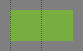 | input**1**_Ground |
|  | input**1**_Ground |
| 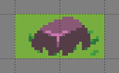 | input**2**_Ground |

The first two layers both have the index 1, so Automapping will match any combination of those grass and flower tiles. The last layer has the index 2, so its tiles are checked separately. This means these inputs will match any part of the Ground layer that looks like any of these:

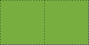

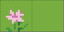
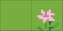
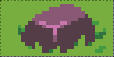

{bdg-secondary-line}`Since Tiled 1.9`

(specialtiles)=
#### Matching Special Cases

In some cases, your tiles alone aren't enough to define the scenario you want to match. Tiled provides a built-in “Automapping Rules Tileset” to handle certain special cases, which can be added to your rule map through *Map > Add Automapping Rules Tileset*.

[Empty]{.tile .empty}
: This tile matches any empty cell. If used on an `output` layer, this tile will output an empty tile, allowing you to erase tiles with Automapping.

[Ignore]{.tile .ignore}
: This tile does not affect the rule in any way. Its only function is to allow connecting otherwise disconnected parts into a single rule, but it can also be used for clarity.

[NonEmpty]{.tile .nonempty}
: This tile matches any non-empty cell.

[Other]{.tile .other}
: This tile matches any cell, which contains a tile that is *different* from all the tiles used by the current rule targeting the same input layer. This includes empty cells, unless the Empty tile is explicitly used elsewhere by the rule (since Tiled 1.10).

[Negate]{.tile .negate}
: This tile negates the condition at a specific location, making other `input` layers with the same target layer name act like inputnot and vice versa, but only in that location, which can simplify your rules in some cases.

The meaning of these tiles is derived from their custom **MatchType** property. This means that you can set up your own tiles for matching these special cases as well!

### Defining Outputs

The `output` layers define what will be output when the input of the rule matches something in the working map. These can be Tile or Object Layers, and their names must follow this scheme, which is similar to that of `input` layer names:

```text
output[index]_name
```

Everything after the first underscore is the **name**, which determines which layer in the working map the tiles or objects will be placed on. If the working map includes multiple layers by this name, the bottom-most one will be used. If the rule matches and the working map does not already contain the named output layer, Automapping will create the layer.

The **index** is optional, and is not related to the input indices. Instead, output indices are used to randomize the output: every time the rule finds a match, a random output index is chosen and only the output layers with that index will have their contents placed into the working map.

{bdg-primary}`New in Tiled 1.10.3`
For convenience, Tiled 1.10.3 introduced two changes to the behavior related to indexes. If an output index is completely empty for a given rule, it will never be chosen for that rule. This is useful when some rules have more random options than others. Also, when no index is specified, that part of the rule's output will always apply when the rule matches. This can be used to combine an unconditional part of a rule's output with a random part.

#### Random Output Example

Continuing with the example from before, you can use output layers like these to randomise the Ground layer:

| Tile Layer | Name |
| --- | --- |
|  | output**1**\_Ground |
|  | output**2**\_Ground |
|  | output**3**\_Ground |
| 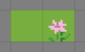 | output**4**\_Ground |

By default, the output of a rule is allowed to overlap previous output from the same rule, which isn't always what you want. In the example above, the output rocks can be partially overwritten by subsequent outputs from that rule. You can set the [**NoOverlappingOutput**](#NoOverlappingOutput) map property to `true` to avoid this. This will only apply to rules overlapping their own output, however - outputs from different rules will still be allowed to overlap. If you want to avoid any kind of overlap, you will need to design your inputs such that your inputs are specific enough for different rules to not overlap.

```{figure} images/automapping/automap_output_overlap2.png
:alt: Automap output with numerous half-rocks where different outputs overlapped each other.

Because outputs are allowed to overlap each other and the inputs aren't very specific, the two-tile rock outputs are overlapped by subsequent outputs.
```

```{figure} images/automapping/automap_output_overlap3.png
:alt: Automap output where each rock is whole.

With **NoOverlappingOutput** set to `true`, outputs don't overlap and all the rocks are whole.
```

Sometimes, you may want certain outputs to appear more or less frequently than others. The above example would look much nicer if the flowers and rocks didn't appear quite so often. You can control the probability of an output index by setting the [**Probability**](#outputProbability) layer property on one of the layers for that index.

```{figure} images/automapping/automap_output_overlap1.png
:alt: Automap output where most of the ground is grass, with a few flowers and just one rock.

Setting the **Probability** of the grass output to 20 and the **Probability** of the rock output to 0.5 produces much nicer-looking results.
```

(objectRegion)=
:::{warning}
While Automapping can output Objects, there are some caveats when it comes to detecting whether they're part of a given rule's output:

* Object rotation is not taken into account.
* Tile Objects' Object Alignment is not taken into account.
* Ellipse and Text Objects use their bounding rectangles.
* Point positions are checked *exclusively*, a Point must be within a given cell to count as part of it, merely touching the cell is not enough.
* Polygons and Polylines are checked as if they were Points at their position, the rest of the shape is not taken into account.

You can ensure these Objects are output by putting [Ignore]{.tile .ignore} [special tiles](#specialtiles) in a tile output layer at their position. You may also need to connect this tile to the rest of the rule with more Ignore tiles to make sure it isn't treated as a separate rule.
:::

Any custom properties set on an output layer (other than **Probability**) will be copied to the target layer when the output is applied. You should normally not need to add any such properties to output layers, but this can be a way to automate setting properties on your layers based on their contents.

## Automapping Properties

The behavior of your rules can be modified by properties on the rules map, input and output layers, and on a per-rule basis using objects.

### Map Properties

(DeleteTiles)=
DeleteTiles
: This is a boolean map property: it can be `true` or `false`. When `true`, if rules of this rule map get applied at some location in your map, all existing tiles in the input region are deleted before applying the output. The usual way to erase tiles via Automapping is to output the [Empty]{.tile .empty} [special tile](#specialtiles), but this property can save you time your rules do a lot of deletions on certain layers.

  Despite the name, this property affects output Object Layers too, deleting any Objects that fully or partially overlap the input region of any rule that matches. This is currently the only way to delete Objects via Automapping.

  :::{warning}
  Objects are only deleted when they overlap tiles in the input region. All the caveats of outputting objects also apply, see the [warning in the Defining Outputs section](#objectRegion).
  :::

(AutomappingRadius)=
AutomappingRadius
: This map property is a number: 1, 2, 3 … When using Automap While Drawing, this property determines how far beyond the tiles affected by your changes Automapping will look for matches.

MatchOutsideMap {bdg-secondary-line}`Since Tiled 1.2`
: This boolean map property determines whether rules can match even when their input region falls partially outside of a map. By default it is `false` for bounded maps and `true` for infinite maps. In some cases it can be useful to enable this for bounded maps. Tiles outside of the map boundaries are simply considered empty, unless one of either **OverflowBorder** or **WrapBorder** are also true.

  Tiled 1.0 and 1.1 behaved as if this property was `true`, whereas older versions of Tiled behaved as if this property was `false`.

OverflowBorder {bdg-secondary-line}`Since Tiled 1.3`
: This boolean map property customizes the behavior of the **MatchOutsideMap** property. When this property is `true`, tiles outside of the map boundaries are considered as if they were copies of the nearest inbound tiles, effectively “overflowing” the map’s borders to the outside region.

  When this property is `true`, it implies **MatchOutsideMap**. Note that this property has no effect on infinite maps (since there is no notion of border).

WrapBorder {bdg-secondary-line}`Since Tiled 1.3`
: This boolean map property customizes the behavior of the **MatchOutsideMap** property. When this property is `true`, the map effectively “wraps” around itself, making tiles on one border of the map influence the regions on the other border and vice versa.

  When this property is `true`, it implies **MatchOutsideMap**. Note that this property has no effect on infinite maps (since there is no notion of border).

  If both **WrapBorder** and **OverflowBorder** are `true`, **WrapBorder** takes precedence over **OverflowBorder**.

(MatchInOrder)=
MatchInOrder {bdg-secondary-line}`Since Tiled 1.9`
: When this boolean map property is set to `true`, each rule is applied immediately after a match is found. This disables concurrent matching of rules, but allows each rule to take into account the output of the previously applied rules (as used to be the case before Tiled 1.9).

  Alternatively, you can split up your rules over multiple rule maps. Rule maps are always applied in order, so each rule map can rely on any modifications applied by previous rule maps.

### Layer Properties

The following properties are supported on a per-layer basis:

(AutoEmpty)=
AutoEmpty (alias: StrictEmpty)
: This boolean layer property can be added to `input` and `inputnot` layers to customize the behavior for empty tiles within a rule.

  Normally, empty tiles are simply ignored. When **AutoEmpty** is `true`, empty tiles within the input region match empty tiles in the target layer. This can only happen when you have multiple input/inputnot layers and some of the tiles that are part of the same rule are empty while others are not. Usually, using the [Empty]{.tile .empty} [special tile](#specialtiles) is the best way to specify an empty tile, but this property is useful when you have multiple input layers, some of which need to match many empty tiles. Note that the input region is defined by *all* input layers, regardless of index.

IgnoreHorizontalFlip {bdg-primary}`New in Tiled 1.10.3`
: This boolean layer property can be added to `input` and `inputnot` layers to also match horizontally flipped versions of the input tile.

IgnoreVerticalFlip
: This boolean layer property can be added to `input` and `inputnot` layers to also match vertically flipped versions of the input tile.

IgnoreDiagonalFlip
: This boolean layer property can be added to `input` and `inputnot` layers to also match anti-diagonally flipped versions of the input tile. This kind of flip is used for 90-degree rotation of tiles.

IgnoreHexRotate120
: This boolean layer property can be added to `input` and `inputnot` layers to also match 120-degree rotated tiles on hexagonal maps. However, note that Automapping currently does not really work for hexagonal maps since it does not take into account the staggered axis.

(outputProbability)=
Probability {bdg-primary}`New in Tiled 1.10`
: This float layer property can be added to `output` layers to control the probability that a given output index will be chosen. The probabilities for each output index are relative to one another, and default to 1.0. For example, if you have outputA with probability 2 and outputB with probability 0.5, A will be chosen four times as often as B. If multiple output layers with the same index have their **Probability** set, the last (top-most) layer's probability will be used.

{bdg-secondary-line}`Since Tiled 1.9`

(object-properties)=
### Object Properties

A number of options can be set on individual rules, even within the same rule map. To do this, add an Object Layer to your rule map called `rule_options`. On this layer, you can create plain rectangle objects and any options you set on these objects will apply to all rules they contain.

The following options are supported per-rule:

ModX
: Only apply a rule every N tiles on the X axis (defaults to 1).

ModY
: Only apply a rule every N tiles on the Y axis (defaults to 1).

OffsetX
: An offset applied in combination with ModX (defaults to 0).

OffsetY
: An offset applied in combination with ModY (defaults to 0).

Probability
: The chance that a rule applies at all, even if its input layers would have matched, from 0 to 1. A value of 0 effectively disables the rule, whereas a value of 1 (the default) means it is never skipped.

Disabled
: A convenient way to (temporarily) disable some rules (defaults to `false`).

(NoOverlappingOutput)=
NoOverlappingOutput
: When set to `true`, the output of a rule is not allowed to overlap other outputs of the same rule (defaults to `false`).

(IgnoreLock)=
IgnoreLock {bdg-primary}`New in Tiled 1.10`
: Since Tiled 1.10, Automapping rules no longer modify locked layers. Set this property to `true` to ignore the lock. This can be useful when you have layers that are only changed by rules and want to keep them locked.

All these options can also be set on the rule map itself, in which case they apply as defaults for all rules, which can then be overridden for specific rules by placing rectangle objects.

## Examples

### RPG Cliffs

A common Automapping scenario is to automate the placement of cliff sides. Tilesets will often include cliff tiles like this:

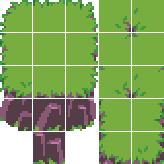

[Terrains](terrain.rst) can be used to place the top of the cliff, but they cannot reliably add the vertical cliffs themselves. Fortunately, they are no problem for Automapping.

```{figure} images/automapping/automap_example1.png
:alt: Cliff top tiles with no sides.

The starting map: the flat top of a cliff painted using Terrains.
```

```{figure} images/automapping/automap_example2.png
:alt: The same cliff, with sides added.

Automapping can add the appropriate cliff tiles.
```

The bottom side and bottom corners of the cliff are the only ones that need cliff tiles in this tileset, so only three rules are needed to add those. The rules are shown below, layer by layer.

| Tile Layer | Name |
| --- | --- |
| 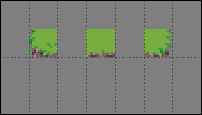 | input\_Cliff |
| 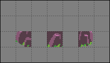 | output**1**\_Cliff |
| 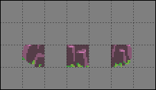 | output**2**\_Cliff |

The two output layers differ only in which tile is output by the middle rule, the two corner output tiles are the same in both cases. These three rules get us most of the way there, but there are still some small issues:

```{figure} images/automapping/automap_example7.png
:alt: The same cliff example as before, with cliffs added, but with some tiles not quite connecting correctly.

The result of the rules above.
```

```{figure} images/automapping/automap_example8.png
:alt: The same example, with the problem tiles circled in yellow.

The bottom corners and sides of the cliff are circled here because they should use different tiles when they're next to a cliff tile.
```

This tileset includes tiles for the sides and bottom corners of the cliff top when they're next to a cliff, so you can make another rule map to place those. Since there are left and right side tiles and left and right corner tiles, you will need four rules.

You could create rules that check for a literal cliff tiles next to these tiles, but that would require enumerating every tile that counts as a cliff - all the cosmetic variants of straight cliff section, the cliff corners, and if you're not careful, you might still miss some edge cases like two cliff sides facing each other. A simpler approach would be check whether the tile above this side or corner is a concave corner tile: if it is, then you know that the tile next to it will be something with a cliff.

| Tile Layer | Name |
| ---        | ---  |
| 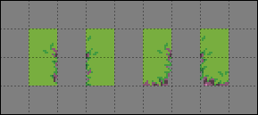 | input\_Cliff |
| 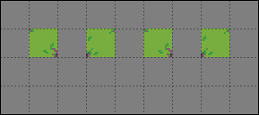 | input\_Cliff |
| 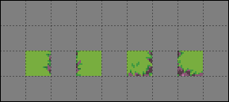 | output\_Cliff |

There is no need to repeat the side and corner tiles on the second "input\_Cliff" layer, you can leave those cells empty and only include the extra input tiles that you need.

With these additional rules in place, you should get the result shown at the top of this section: all the cliffs in place, with no transparent holes where sides and corners meet the cliffs.

Since these rules work with a layer called "Cliff", they will not affect cliffs drawn on any other layers. If you want to automap cliffs on several different layers, which may be necessary if you want stacks of cliffs, you'll need to duplicate the rule map and adjust the input and output layer names.

#### Automap While Drawing

The rules above work well if you draw your cliff tops with Terrains and then manually trigger Automapping, but what if you want to see the cliffs appear as you draw with Terrains, or want to keep drawing with Terrains after automapping manually?

```{figure} images/automapping/automap_example14.gif
:alt: Animation showing erasing the cliff top Terrain. The cliff top is updated correctly, but the cliff tiles are not.

Without some extra rules, Automap While Drawing can produce messy results.
```

For this, your rules will need to take into account tiles that may have previously been placed by Automapping.

:::{hint}
If you're using Automapping While Drawing with Terrains, it also helps for your Terrains to be aware of the tiles that may be output to that same layer by Automapping. In this example, this would mean labeling the side and corner tiles meant to be next to cliffs with the same Terrain labels as their base versions.

This will have the side effect of making Terrains randomly output those tiles where they're not needed, but this can be remedied by setting the tile probability of those tiles to 0 in the Tileset Editor. If you *always* use those Terrains with Automapping, you can also just let Automapping fix the tiles.
:::

There are two approaches you can take to make your Automapping rules take its own output into account:

*   Include those tiles as alternate inputs in all the rules, or
*   Make another set of rules to reset all the alternate tiles to a uniform condition.

The appropriate option will depend on your specific rules. In this case, the latter is simpler: all you have to do is erase any cliff tiles, and replace the variants meant to be placed next to cliffs with their basic versions. For this purpose, you should create another rule map, and place it *before* the other rules in your `rules.txt`, so that it can prepare the map for those other rules. The actual rules are just simple substitutions:

| Tile Layer | Name |
| --- | --- |
| 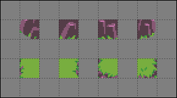 | input\_Cliff |
| 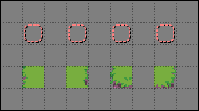 | output\_Cliff |

The output tiles in the top row are the [Empty]{.tile .empty} [special tile](#specialtiles), which means the output will erase those tiles.

For Automap While Drawing to work correctly, you may also need to increase the [**AutomappingRadius**](#AutomappingRadius) property of your rules maps. This is because some of the rules may look only at tiles *near* the ones you change by drawing, such as the rules that erase cliff tiles. In this example, you will probably need to set the **AutomappingRadius** to 1 on the reset rules and on the rules that add cliffs.

```{figure} images/automapping/automap_example15.gif
:alt: Animation showing erasing the cliff top Terrain. This time, everything is updated correctly.

Now, Automap While Drawing produces correct results.
```

(sidescroller-details)=
### Sidescroller Details

You can use Automapping to add various details to your maps. This small example shows adding foreground details to a sidescroller platforms. This tileset features a number of platform tiles, some of which have rocky tops, and some of which have grassy tops. These two rules will add random grass and flower decorations to a different layer corresponding to the grassy-topped tiles, and delete any decorations that end up on top of non-grassy tiles. There are many input layers, because there are many grassy-topped tiles to check.

| Tile Layer | Name |
| --- | --- |
|  | input\_Platform |
| 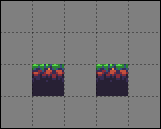 | input\_Platform |
| 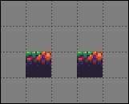 | input\_Platform |
| 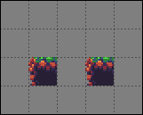 | input\_Platform |
| 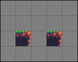 | input\_Platform |
| 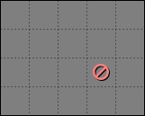 | input\_Platform |
| 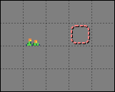 | outputA\_Foreground |
| 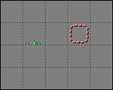 | outputB\_Foreground |
| 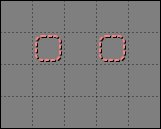 | outputC\_Foreground |

The inputs for these rules are identical except for the last input layer, in which the second rule, which deletes the foreground detail tiles, has the [Negate]{.tile .negate} [special tile](#specialtiles). This makes all those `input` layers act like `inputnot` layers, but only in that specific location. This means the first rule matches whenever it encounters any of those grassy-topped tiles, while the second rule matches whenever it encounters *anything other* than those grassy-topped tiles. The second rule could've also been made with a bunch of `inputnot` layers instead, but using the Negate tile reduces how many layers this rule map needs, and it's easier to see that the input tiles are negated when the layers are all viewed together:

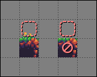

The three outputs select a random foreground detail for the first rule, and are all Empty for the second rule. One of the outputs for the first rule is also Empty, just for extra variety.

```{figure} images/automapping/automap_example26.png
:alt: Platforms with grass and flowers over some of the grassy tiles.

A result from the two rules above.
```

(updating-rules)=
## Updating Legacy Rules

If you have some Automapping rules from before Tiled 1.9, they should still work much as they always did in most cases. When Tiled sees that a rule map contains `regions` layers, it will automatically bring back the old behavior - rules will be matched in order by default, cells within input regions that are empty in all the input layers for a given layer and index will be treated as "Other", and completely empty output indices will still be selected as valid outputs.

:::{warning}
In Tiled 1.9.x, the presence of `regions` layers did not imply **MatchInOrder**. If you're using 1.9.x rather than 1.10+ and want to use legacy rules, you'll need to set the **MatchInOrder** map property to `true`.
:::

If you'd like to instead update your rules to not rely on any legacy behavior, that can be as simple as deleting your `regions` layer(s), or it might take some extra work, depending on how exactly your rules are set up:

* If your rules rely on being applied in a set order, set the [**MatchInOrder**](#MatchInOrder) map property to `true`.
* When deleting your `regions` layers, make sure you weren't relying on them to connect otherwise disconnected areas of tiles. If you were, use the [Ignore]{.tile .ignore} [special tile](#specialtiles) to connect them on one of the `input` layers, so that Tiled knows they're part of the same rule. To make sure the rules behave exactly the same, fill in any part that was previously part of the input region.

* If were using the [**DeleteTiles**](#DeleteTiles) map property to erase tiles from the output layer, you can keep using this property. If you want to make your rule more visually clear, however, you should unset the **DeleteTiles** property, and instead use the [Empty]{.tile .empty} [special tile](#specialtiles) in all the output cells you want to delete from.

* If were using the [**StrictEmpty**](#AutoEmpty) map property to look for empty input tiles, you should now use the Empty special tile instead in the cells you want to check for being empty. You can also continue use the **StrictEmpty** property (or its newer alias, **AutoEmpty**), as long as at least one other input layer is not empty at those locations.

* If were relying on the behavior that any tile which is left empty on all of the input layers for a given index is treated as “any tile not in this rule”, you should instead use the [Other]{.tile .other} [special tile](#specialtiles) at those locations, and also the [Empty]{.tile .empty} [special tile](#specialtiles) on an inputnot layer at those same locations. The Empty tile is needed because old-style Other never matched Empty, but the MatchType Other tile does match Empty.

* If you have rules that rely on some output indices being empty to randomly not make any changes, you will need to place [**Ignore** special tiles](#specialtiles) in at least one layer of each empty output index so that those indices aren't ignored. Alternatively, you can use [`rule_options`](#object-properties) to give those rules a chance to not run at all.

* If you had rules with random output, but did not specify an index for one of the outputs, this part of the rule's output is now excluded from the options and applied unconditionally instead. If all outputs should be random options, make sure they all have an index. You can automate updating your existing rule maps with the "[Add Output Index](https://github.com/mapeditor/tiled-extensions/blob/master/AddOutputIndex.js)" script.

## Credits

The [Sidescroller Details](#sidescroller-details) example uses art from [A platformer in the forest](https://opengameart.org/content/a-platformer-in-the-forest) by Buch.
