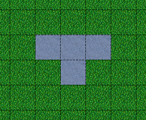
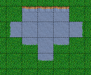
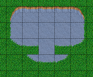
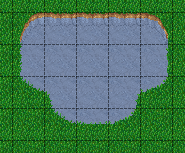
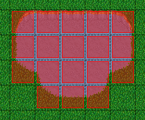
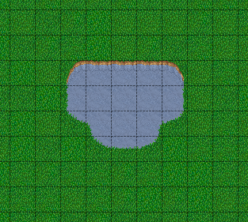
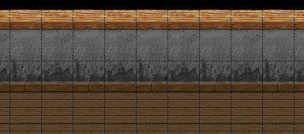
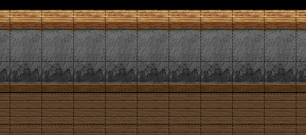

***********
Automapping
***********

What is Automapping?
====================

Automapping is an advanced tool to automatically search certain
combinations of tiles across layers in a map and to replace these parts
by other combination. This allows the user to draw structures with a
minimum of time spent and the Automapping will be able to generate a
rather complex scenario, which would need lots more time if manually
crafted.

So the goal of Automapping is that you only need to draw within one
layer and everything else is setup for you. This brings some advantages:

-  **Working speed** - you need less time to setup a map.
-  **Less errors** - the main reason is to reduce the error rate. If you
   have setup the rules properly, there is no hidden error.

External Links
--------------

* `Automapping explained for Tiled 0.9 and later (YouTube) <http://www.youtube.com/watch?v=UUi0lD1pxyQ>`__
* `Examples on Automapping <https://github.com/stefanbeller/tiled_examples>`__
* `Tiled Map Editor Tutorial Part Three: AutoMap (YouTube) <https://youtu.be/A_A6rz7cvG4>`__

Setting it Up
=============

The Automapping feature is looking for a text file called 'rules.txt' in
the folder where the current map is located. Each line in this text file
is either

-  a path to a **rulefile**
-  or a path to another textfile which has the same syntax (i.e. in
   another directory)
-  or is a comment which is indicated by **#** or **//**

A **rulefile** is a standard map file, which can be read and written by
tiled (\*.tmx). In one rulefile there can be defined multiple rules.

An automapping **rulefile** consists of 4 major parts:

#. The definition of regions describes which locations of the rulemap
   are actually used to create Automapping rules.
#. The definition of inputs describes which kind of pattern the working
   map will be searched for.
#. The definition of outputs describes how the working map is changed
   when an input pattern is found.
#. The map properties are used to fine-tune the input pattern
   localization and the output of all rules within this rules file.

Defining the Regions
--------------------

There must be either a tile layer called **regions** or there must be the
both tile layers **regions\_input** and **regions\_output**. Using the
**regions** layer, the region defined for input and output is the same.
Using the different layers **regions\_input** and **regions\_output**
delivers the possibility to have different regions for the input section
and the output section. The region layer(s) are only used to mark
regions, where an Automapping rule exists. Therefore it does not matter
which tiles are used in this layer, since these tiles are just used to
define a region. So either use any tile or no tile at a coordinate to
indicate if that coordinate belongs to a rule or if it doesn't.

If multiple rules are defined in one rulemap file, the regions must not
be adjacent. That means there must be at least one tile of unused space
in between two rules. If the regions are adjacent (coherent) then both
regions are interpreted as one rule.

Multiple Rules in One Rulefile
~~~~~~~~~~~~~~~~~~~~~~~~~~~~~~

Of course multiple rules are possible in one rulemap. If you want to
have the rules applied in a certain sequence, you should use multiple
**rulefiles** and define the sequence within the **rules.txt** file. As
of now there also is a certain sequence within one rulemapfile.
Generally speaking the regions with small y value come first. If there
are regions at the same y value, then the x value is taken into account.
On orthogonal maps this ordering scheme is the same as for reading in
most western countries. (Left to right, top to down). The order within
one rulemap may be changed later, once tiled is capable of utilizing
multiple threads/processors. So if you want to rely on a certain
sequence, use different rulemaps and order these in the rules.txt

Definition of Inputs
--------------------

Inputs are generally defined by tile layers which name follows this
scheme:

**input[not][index]\_name**

where the **[not]** and **[index]** are optional. After the first
underscore there will be the name of the input layer. The input layer
name can of course include more underscores.

The **name** determines which layer on the working map is examined. So
for example the layer *input\_Ground* will check the layer called
*Ground* in the working map for this rule. *input\_test\_case* will
check the layer *test\_case* in the working map for this rule.

Multiple layers having the same name and index is explicitly allowed and
is intended. Having multiple layers of the same name and index , will
allow you to define different possible tiles per coordinate as input.

The index is used to create complete different input conditions. All
layers having the same index are taken into account for forming one
condition. Each of these conditions are checked individually.

#. index must not contain an underscore.
#. index must not start with *not*
#. index may be empty.

If there are tiles in the standard input layers one of these tiles must
be there to match the rule. The optional **[not]** inverts the meaning
of that layer. So if there are **inputnot** layers, the tiles placed on
them, must not occur in the working map at the examined region to make a
rule match. Within one rule you can combine the usage of both input and
inputnot layers to make rules input conditions as accurate as you need
or as fuzzy as you need.

Definition of Outputs
---------------------

Outputs are generally defined by layers whichs name follows this scheme

**output[index]\_name**

which is very similar to the input section. At first there must be the
word output. Then optionally an **[index]** may occur. After the first
underscore there will be the name of the target layer. The target layer
name can of course include more underscores.

All layers of the same index are treated as one possible output. So the
intention of indexes in the outputs of rules is only used for random
output.

The indexes in the output section have nothing to do with the indexes in
the input section, they are independent. In the output section they are
used for randomness. In the input section they are used to define
multiple possible layers as input. So when there are multiple indexes
within one rule, the output will be chosen fairly (uniformly
distributed) across all indexes. So a dice will be rolled and one index
is picked. All of the output layers carrying this index will be put out
into the working map then.

Note that the output is not being checked for overlapping itself. This
can be achieved by setting the map property **NoOverlappingRules** to
true.

Map Properties
--------------

There are three different map properties, which can be used to add
additional information to a **rulefile**:

DeleteTiles
   This map property is a boolean property: it can be
   true or false. If rules of this rulefile get applied at some location
   in your map, this map property determines if all other tiles are
   deleted before applying the rules. Consider a map where you have
   multiple layers. Not all layers are filled at all places. In that
   case all tiles of all layers should be cleared, so afterwards there
   are only the tiles which are defined by the rules. Since when not all
   tiles are cleared before, you will have still tiles from before at
   these places, which are not covered by any tile.

AutomappingRadius
   This map property is a number: 1, 2, 3 ... It
   determines how many tiles around your changes will be checked as well
   for redoing the Automapping at live Automapping.

NoOverlappingRules
   This map property is a boolean property:
   A rule is not allowed to overlap on itself.

These properties are map wide, meaning it applies to all rules which are
part of the rulemap. If you need rules with different properties, you
can use multiple rulemaps.

Layer Properties
----------------

The following properties are supported on a per-layer basis:

StrictEmpty
   This layer property is a boolean property. It can be added to
   **input** and **inputnot** layers to customize the behavior for
   empty tiles within the input region.

   In "StrictEmpty" mode, empty tiles in the input region match empty tiles
   in the set layer. So when an "input" layer contains an empty tile within
   the input region, this means an empty tile is allowed at that location.
   And when an "inputnot" layer contains an empty tile within the input region,
   it means an empty tile is not allowed at that location.

Converting Rules From 0.8 and Below
===================================

There is a tool **automappingconverter** along in your distribution to
convert the rules created for previous versions of Tiled to version 0.9
and later.

If you are compiling tiled from scratch the tool is found in the in
**/bin/** folder.

The changes for conversion are only layer renaming:

Previous **RuleRegion** will be named **regions**

Previous **RuleSet** will be named **input\_set**

Previous **RuleNotSet** will be named **inputnot\_set**

Previous **Rule\_\*** will be named **output\_\***

Examples
========

All of the examples are for version 0.9 and later. If you want to see
examples for tiled version 0.8 and below, `have a look in this
archive. <https://github.com/stefanbeller/tiled_examples/zipball/v0.8andbefore>`__

Abstract Input Layer Examples
-----------------------------

Having Multiple Input Layers with the Same Name
~~~~~~~~~~~~~~~~~~~~~~~~~~~~~~~~~~~~~~~~~~~~~~~

Assume the following 3 tile layers as input, which possible inputs are
there in the working map?

+----------------------------------------------------+-----------------+
| Tile layer                                         | Name            |
+====================================================+=================+
| .. image:: images/automapping/abstract/12.png      | input\_Ground   |
|    :alt: tiles 1 and 2                             |                 |
+----------------------------------------------------+-----------------+
| .. image:: images/automapping/abstract/34.png      | input\_Ground   |
|    :alt: tiles 3 and 4                             |                 |
+----------------------------------------------------+-----------------+
| .. image:: images/automapping/abstract/56.png      | input\_Ground   |
|    :alt: tiles 5 and 6                             |                 |
+----------------------------------------------------+-----------------+

The following parts would be detected as matches for this rule:

+----------------------------------------------------+--------------------------------------------------+------------------------------------------------+
| .. image:: images/automapping/abstract/12.png      | .. image:: images/automapping/abstract/32.png    | .. image:: images/automapping/abstract/52.png  |
|    :alt: tiles 1 and 2                             |    :alt: tiles 3 and 2                           |    :alt: tiles 5 and 2                         |
+----------------------------------------------------+--------------------------------------------------+------------------------------------------------+
| .. image:: images/automapping/abstract/14.png      | .. image:: images/automapping/abstract/34.png    | .. image:: images/automapping/abstract/54.png  |
|    :alt: tiles 1 and 4                             |    :alt: tiles 3 and 4                           |    :alt: tiles 5 and 4                         |
+----------------------------------------------------+--------------------------------------------------+------------------------------------------------+
| .. image:: images/automapping/abstract/16.png      | .. image:: images/automapping/abstract/36.png    | .. image:: images/automapping/abstract/56.png  |
|    :alt: tiles 1 and 6                             |    :alt: tiles 3 and 6                           |    :alt: tiles 5 and 6                         |
+----------------------------------------------------+--------------------------------------------------+------------------------------------------------+

Input Layers Using Different Indexes
~~~~~~~~~~~~~~~~~~~~~~~~~~~~~~~~~~~~

Given the following 3 input tile layers:

+----------------------------------------------------+-----------------+
| Tile layer                                         | Name            |
+====================================================+=================+
| .. image:: images/automapping/abstract/12.png      | input\_Ground   |
|    :alt: tiles 1 and 2                             |                 |
+----------------------------------------------------+-----------------+
| .. image:: images/automapping/abstract/34.png      | input\_Ground   |
|    :alt: tiles 3 and 4                             |                 |
+----------------------------------------------------+-----------------+
| .. image:: images/automapping/abstract/56.png      | input2\_Ground  |
|    :alt: tiles 5 and 6                             |                 |
+----------------------------------------------------+-----------------+

The last layer has an index unequal to the other indexes (which are
empty). All following parts would be recognized as matches within the
working map:

+----------------------------------------------------+--------------------------------------------------+
| .. image:: images/automapping/abstract/12.png      | .. image:: images/automapping/abstract/32.png    |
|    :alt: tiles 1 and 2                             |    :alt: tiles 3 and 2                           |
+----------------------------------------------------+--------------------------------------------------+
| .. image:: images/automapping/abstract/14.png      | .. image:: images/automapping/abstract/34.png    |
|    :alt: tiles 1 and 4                             |    :alt: tiles 3 and 4                           |
+----------------------------------------------------+--------------------------------------------------+
| .. image:: images/automapping/abstract/56.png      |                                                  |
|    :alt: tiles 5 and 6                             |                                                  |
+----------------------------------------------------+--------------------------------------------------+

The Mana World Examples
-----------------------

The Mana world examples will demonstrate quite a lot of different
Automapping features. At first a shoreline will be constructed, by first
adding all the straight parts and afterwards another rule will correct
the corners to make them also fit the given tileset. After the shoreline
has been added, the waters will be marked as unwalkable for the game
engine. Last but not least the grass should be tiles should be made
random by using 5 different grasss tiles.

   This is what we want to draw.

   Here we have straight shorelines applied.

   Here we have some corners.

   And corners the other way round as well.

   Here all unwalkable tiles are marked.

   If you look closely at the grass, you'll see they are now randomized.

Basic Shoreline
~~~~~~~~~~~~~~~

This example will demonstrate how a straight shoreline can easily be
setup between shallow water grass tiles. In this example we will only
implement the shoreline, which has grass in southern and water in
northern direction.

So basically the meaning we will define in the input region is: *All
tiles which are south of a water tile and are no water tiles itself,
will be replaced by a shoreline tile*

+-----------------------------------------------------------+------------------+
| Tile layer                                                | Name             |
+===========================================================+==================+
| .. image:: images/automapping/TheManaWorld/1/regions.png  | regions          |
+-----------------------------------------------------------+------------------+
| .. image:: images/automapping/TheManaWorld/1/input.png    | input\_Ground    |
+-----------------------------------------------------------+------------------+
| .. image:: images/automapping/TheManaWorld/1/output.png   | output\_Ground   |
+-----------------------------------------------------------+------------------+

The region in which this Automapping rule should be defined is of 2
tiles in height and 1 tile in width. Therefore we need a layer called
*regions* and it will have 2 tiles placed to indicate this region.

The input layer called *input\_Ground* is depicted in the middle. Only
the upper tile is filled by the water tile. The lower tile contains no
tile. It is not an invisible tile, just no tile at all.

And whenever there is no tile in a place within the rule regions in an
input layer, what kind of tiles will be allowed there? There will be
allowed any tiles except all used tiles within all input layer with the
same index and name.

Here we only have one tile layer as an input layer carrying only the
water tile. Hence at the position, where no tile is located, all tiles
except that water tile are allowed.

The output layer called *output\_Ground* shows the tile which gets
placed, if this rule matches.

Corners on a Shore Line
~~~~~~~~~~~~~~~~~~~~~~~

This example is a continuation of the previous example. Now the corners
of the given shoreline should be implemented automatically. Within this
article we will just examine the bent in corner shoreline in the topleft
corner. The other shoreline corners are constructed the same way. So
after the example is applied, we would like to have the corners of the
shoreline get suitable tiles. Since we rely on the other example being
finished, we will put the rules needed for the corners into another new
rulefile. (which is listed afterwards in rules.txt)

+-----------------------------------------------------------+-----------------------------------------------------------+-----------------------------------------------------------+
| .. image:: images/automapping/TheManaWorld/2/pattern1.png | .. image:: images/automapping/TheManaWorld/2/pattern2.png | .. image:: images/automapping/TheManaWorld/2/pattern3.png |
+-----------------------------------------------------------+-----------------------------------------------------------+-----------------------------------------------------------+
| .. image:: images/automapping/TheManaWorld/2/pattern4.png | .. image:: images/automapping/TheManaWorld/2/pattern5.png | .. image:: images/automapping/TheManaWorld/2/pattern6.png |
+-----------------------------------------------------------+-----------------------------------------------------------+-----------------------------------------------------------+
| .. image:: images/automapping/TheManaWorld/2/pattern7.png | .. image:: images/automapping/TheManaWorld/2/pattern8.png | .. image:: images/automapping/TheManaWorld/2/pattern9.png |
+-----------------------------------------------------------+-----------------------------------------------------------+-----------------------------------------------------------+

The shoreline may have some more corners nearby, which means there may
be more different tiles than the straigt corner lines. In the figure we
see all inputs which should be covered.

Both the tiles in the top right corner and in the lower left corner are
directly adjacent to the desired (slightly transparent) tile in the top
left corner.

We can see 3 different tiles for the lower left corner, which is
straight shore line, bent inside and bend outside shore lines.

Also we see 3 different inputs for the top right corner, which also is
straight, bent in or out shore line.

regions
^^^^^^^

So with this rule we want to put the bent in shore line tile in the top
left corner, hence we don't care which tile has been there before. Also
we don't care about the tile in the lower right corner. (probably water,
but can be any decorative watertile, so just ignore it).

+-----------------------------------------------------------------+------------------------------------------------------------------+-------------------------------------------------------------------+
| .. image:: images/automapping/TheManaWorld/2/regions_input.png  | .. image:: images/automapping/TheManaWorld/2/regions_output.png  | .. image:: images/automapping/TheManaWorld/2/regions_united.png   |
+-----------------------------------------------------------------+------------------------------------------------------------------+-------------------------------------------------------------------+

Therefore we will need different input and output regions. In the figure
we can see the both tilelayers regions input and regions output. The
input section covers just these two tiles as we discussed. The output
region covers just the single tile we want to output. Though the input
and output region do not overlap, the united region of both the input
and the output region is still one coherent region, so it's one rule and
works.

Output regions can be larger than absolutely required, since when there
are no tiles in the Output section, the tiles in the working map are not
overwritten but just kept as is, hence the Output region could also be
sized as the united region of both the output and input region.

regions\_input
^^^^^^^^^^^^^^

Now we want to put all the nine possible patterns we observed as
possible input for this rule. We could of course define nine different
layers *input1\_Ground* up to *input9\_Ground*

Nine TileLayers?! what a mess, we'll put it in a better way.

Also consider not having just 3 possible tiles at the 2 locations but 4.
Then we would need 4\*4=16 tilelayers to get all conditions. Another
downside of this comes with more needed locations: Think of more than 2
locations needed to construct a ruleinput. So for 3 locations, then each
location could have the 3 possibilites, hence you need 3\*3\*3 = 27
tilelayers. It's not getting better...

So let's try a smart way: All input layers have the same name, so at
each position any of the three different tiles is valid.

+------------------------------------------------------------------+-----------------+
| Tile layer                                                       | Name            |
+==================================================================+=================+
| .. image:: images/automapping/TheManaWorld/2/input_Ground1.png   | input\_Ground   |
+------------------------------------------------------------------+-----------------+
| .. image:: images/automapping/TheManaWorld/2/input_Ground2.png   | input\_Ground   |
+------------------------------------------------------------------+-----------------+
| .. image:: images/automapping/TheManaWorld/2/input_Ground3.png   | input\_Ground   |
+------------------------------------------------------------------+-----------------+

outputs
^^^^^^^

The output is straight forward, since only one tile is needed. No
randomness is needed, hence the index is not needed to be varied, so
it's kept empty. The desired output layer is called Ground, so the over
all name of the single output layer will be output Ground. At this
single layer at the correct location the correct tile is placed.

+------------------------------------------------------------------+
| .. image:: images/automapping/TheManaWorld/2/output_Ground.png   |
+------------------------------------------------------------------+

The Other Corners on a Shore Line
~~~~~~~~~~~~~~~~~~~~~~~~~~~~~~~~~

This is for corners bent the other way round. Basically it has the same
concepts, just other tiles.

+-------------------------------------------------------------------+-------------------+
| Tile layer                                                        | Name              |
+===================================================================+===================+
| .. image:: images/automapping/TheManaWorld/3/input_Ground1.png    | input\_Ground     |
+-------------------------------------------------------------------+-------------------+
| .. image:: images/automapping/TheManaWorld/3/input_Ground2.png    | input\_Ground     |
+-------------------------------------------------------------------+-------------------+
| .. image:: images/automapping/TheManaWorld/3/input_Ground3.png    | input\_Ground     |
+-------------------------------------------------------------------+-------------------+
| .. image:: images/automapping/TheManaWorld/3/output_Ground.png    | output\_Ground    |
+-------------------------------------------------------------------+-------------------+
| .. image:: images/automapping/TheManaWorld/3/regions_input.png    | regions\_input    |
+-------------------------------------------------------------------+-------------------+
| .. image:: images/automapping/TheManaWorld/3/regions_output.png   | regions\_output   |
+-------------------------------------------------------------------+-------------------+

Adding Collision Tiles
~~~~~~~~~~~~~~~~~~~~~~

The Mana World uses an extra tile layer called *Collision* to have
information about whether a player is able to walk at certain tiles or
if it is not. That layer is invisible to the player, but the game engine
parses it, whether there is a tile or there is no tile.

So we need to decide for each position if a player can walk there and
put a tile into the *Collision* layer if it is unwalkable.

As *input* layer we will parse the *Ground* layer and put collision
tiles where the player should not walk.

Actually this task is a bunch of rules, but each rule itself is very
easy:

+----------------------------------------------------------------------+---------------------+
| Tile layer                                                           | Name                |
+======================================================================+=====================+
| .. image:: images/automapping/TheManaWorld/4/regions.png             | regions             |
+----------------------------------------------------------------------+---------------------+
| .. image:: images/automapping/TheManaWorld/4/input_Ground.png        | input\_Ground       |
+----------------------------------------------------------------------+---------------------+
| .. image:: images/automapping/TheManaWorld/4/output_Collision.png    | output\_Collision   |
+----------------------------------------------------------------------+---------------------+

In the above *regions* layer we have 14 different rules, because there
are 14 incoherent regions in the *regions* layer. That's 9 different
water tiles, which should be unwalkable and 5 different grass tiles
which will be placed randomly in the next example.

As input we will have one of all the used tiles and as output there is
either a tile in the *Collision* layer or not.

**Do we need the rules with clean output?** No, it is not needed for one
run of Automapping. But if you are designing a map, you will likely add
areas with collision and then remove some parts of it again and so on.

So we need to also remove the collision tiles from positions, which are
not marked by a collision any more. This can be done by adding the map
property *DeleteTiles* and setting it to *yes* or *true*. Then all the
parts in the *Collision* layer will be erased before the Automapping
takes place, so the collision tiles are only placed at real unwalkable
tiles and the history if there has been a collision place is neglected.

Random Grass Tiles
~~~~~~~~~~~~~~~~~~

In this example we will shuffle all grass tiles, so one grass tiles will
be replaced with another randomly chosen tile.

As input we will choose all of our grass tiles. This is done by having
each tile in its own input layer, so each grass tile gets accepted for
this rule.

As output we will also put each grass tile into one output layer. To
make it random the *index* of the output layers needs to be different
for each layer.

The following rule might look always the same, but there are different
grass tiles. Each grass tile is in both one of the input and one of the
output layers (the order of the layers doesn't matter).

+-------------------------------------------------------------------------------+-------------------+
| Tile layer                                                                    | Name              |
+===============================================================================+===================+
| .. image:: images/automapping/TheManaWorld/5/regions.png                      | regions           |
+-------------------------------------------------------------------------------+-------------------+
| .. image:: images/automapping/TheManaWorld/5/1.png                            | input\_Ground     |
+-------------------------------------------------------------------------------+-------------------+
| .. image:: images/automapping/TheManaWorld/5/2.png                            | input\_Ground     |
+-------------------------------------------------------------------------------+-------------------+
| .. image:: images/automapping/TheManaWorld/5/3.png                            | input\_Ground     |
+-------------------------------------------------------------------------------+-------------------+
| .. image:: images/automapping/TheManaWorld/5/4.png                            | input\_Ground     |
+-------------------------------------------------------------------------------+-------------------+
| .. image:: images/automapping/TheManaWorld/5/5.png                            | input\_Ground     |
+-------------------------------------------------------------------------------+-------------------+
| .. image:: images/automapping/TheManaWorld/5/1.png                            | output1\_Ground   |
+-------------------------------------------------------------------------------+-------------------+
| .. image:: images/automapping/TheManaWorld/5/2.png                            | output2\_Ground   |
+-------------------------------------------------------------------------------+-------------------+
| .. image:: images/automapping/TheManaWorld/5/3.png                            | output3\_Ground   |
+-------------------------------------------------------------------------------+-------------------+
| .. image:: images/automapping/TheManaWorld/5/4.png                            | output4\_Ground   |
+-------------------------------------------------------------------------------+-------------------+
| .. image:: images/automapping/TheManaWorld/5/5.png                            | output5\_Ground   |
+-------------------------------------------------------------------------------+-------------------+

An alternating wall
-------------------

This example will demonstrate how a wall as a transition between a
walkable area and the non-walkable black void can easily be setup. As
input a dedicated set layer will be used.

+-------------------------------------------------------+--------------------------------------------------------+
| .. image:: images/automapping/LoneCoder/desired.png   | .. image:: images/automapping/LoneCoder/setlayer.png   |
|    :alt: Vertically the tiles are alternating         |    :alt: A dedicated set layer                         |
+-------------------------------------------------------+--------------------------------------------------------+

In my opinion a dedicated set layer is much easier to use for the rough
draft, but for adding details such as collision information on
decorative tiles the input should use the decoration.

The structure of the input, output and region layer is very similar to
the example of the straight shoreline in The Mana World examples. The
main difference is the different size. Since the wall contains multiple
tiles in height, the height of the rulelayers is different as well.
Vertically the tiles are also alternating. As you can see in the
following figure, every second tile displaying the base board of the
wall has a notch for example.

+-----------------------------------------------------------+-----------------+
| Tile layer                                                | Name            |
+===========================================================+=================+
| .. image:: images/automapping/LoneCoder/regions.png       | regions         |
+-----------------------------------------------------------+-----------------+
| .. image:: images/automapping/LoneCoder/input_Ground.png  | input\_Ground   |
+-----------------------------------------------------------+-----------------+
| .. image:: images/automapping/LoneCoder/output_Ground.png | output\_Walls   |
+-----------------------------------------------------------+-----------------+

Hence the region in which this Automapping rule should be defined is of
4 tiles in height and 2 tile in width. Therefore we need a layer called
*regions* and it will have 8 tiles placed to indicate this region. In
the figure the top graphics shows such a region layer.

The input layer has the following meaning:

*If there are 2 vertical adjacent brown tiles in the set layer and in
the 3x2 tiles above here are no brown tiles, this rule matches.*

Only the lowest 2 coordinates contain the brown tile. The upper
coordinates contains no tile. (It is not an invisible tile, just no tile
at all.) The input layer called *Input\_set* is depicted in the middle
of the figure.

The output consists of only one layer as well called *Output\_Walls*. It
contains the actual wall tiles.

   Vertically the tiles are alternating.

   A broken version of the rule, *NoOverlappingRules* was not yet set.

When trying to match the input layer to the desired set layer (right
picture of the figure at the beginning of the example, you will see it
matches all way long, no matter of the vertical adjustment.

Hence when we use the rule as discussed now, we will get not the desired
result, but this rule overlaps itself. The overlapping problem is shown
in figure above.

Since the overlapping is not desired, we can turn it off by adding a map
property to the rulemap *NoOverlappingRules* and setting it to *true*

Keep in mind that the map property applies for all rules on that rule map.
