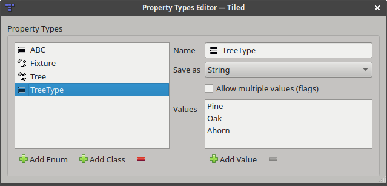

Custom Properties
=================

One of the major strengths of Tiled is that it allows setting custom
properties on all of its basic data structures. This way it is possible
to include many forms of custom information, which can later be used by
your game or by the framework you're using to integrate Tiled maps.

Custom properties are displayed in the Properties view. This view is
context-sensitive, usually displaying the properties of the last
selected object. It also supports multi-selection, for changing the
properties of many objects at once.

.. figure:: images/properties/properties-dock.png
   :alt: Properties View

   Properties View

Adding Properties
-----------------

When you add a property (using the '+' button at the bottom of the
Properties view), you are prompted for its name and its type.
Tiled supports the following basic property types:

-  **bool** (true or false)
-  **color** (a 32-bit color value)
-  **file** (a file reference, which is saved as a relative path)
-  **float** (a floating point number)
-  **int** (a whole number)
-  **object** (a reference to an object) - *Since Tiled 1.4*
-  **string** (any text, including multi-line text)

.. figure:: images/properties/add-property.png
   :alt: Add Property Dialog
   :scale: 66

   Add Property Dialog

The property type is used to choose a custom editor in the Properties
view. Choosing a number or boolean type also avoids that the value will
get quoted in JSON and Lua exports.

.. raw:: html

   
Since Tiled 1.4

The context menu for custom file properties provides a quick way to open the
file in its preferred editor. For object references, there is an action to
quickly jump to the referenced object.

.. raw:: html

   
New in Tiled 1.8

.. _custom-property-types:

Custom Types
------------

In addition to the basic property types listed above, you can define custom
types in your project. Tiled supports :ref:`custom enums <custom-enums>` and
:ref:`custom classes <custom-classes>`.

   Custom Types Editor

.. note::

   These types are automatically saved in the :doc:`project file <projects>`.
   Hence you need to create a project, before you can set up your custom
   types.

.. _custom-enums:

Custom Enums
~~~~~~~~~~~~

An enum is useful if you want to limit the options for a certain property to a
fixed set of values.

An enum also defines how its value is saved. It can be saved as a string,
saving one of its values directly. Alternatively it can be saved as a number,
the index of the current value in the list of values. The former is more
readable whereas the latter could easier and more efficient to load.

Finally, an enum can also allow multiple values to be chosen. In this case
each option is displayed with a checkbox. When saving as string, a
comma-separated list is used and when saving as number the selected indexes are
encoded as bitflags. In both cases, the maximum number of flags supported is 31,
since internally a 32-bit signed integer is used to store the value.

.. _custom-classes:

Custom Classes
~~~~~~~~~~~~~~

A class is useful if you want to be able to add a set of properties at once,
with predefined defaults. It can also prevent excessive prefixing of property
names. Classes can have members referring to other classes.

.. _predefining-properties:

.. raw:: html

   
New in Tiled 1.9

Each data type has a "Class" property, which can be used to refer to a custom
class. The members of this class will then be directly available as custom
properties of that instance (before Tiled 1.9, this feature was only available
for objects and tiles as the "Type" property).

Each class can also have a custom color, which is used to make objects more
recognizable. The class color is used when rendering shape objects, object name
labels and connections between objects.

In the :doc:`JSON </reference/json-map-format>` and :ref:`Lua <lua-export>`
file formats, custom class properties used as property values are saved using
the native object and table constructs.

.. raw:: html

   
Since Tiled 1.0

.. _tile-property-inheritance:

Tile Property Inheritance
-------------------------

When custom properties are added to a tile, these properties will also
be visible when an object instance of that tile is selected. This
enables easy per-object overriding of certain default properties
associated with a tile. This becomes especially useful when combined
with :ref:`typed-tiles`.

Inherited properties will be displayed in gray (disabled text color),
whereas overridden properties will be displayed in black (usual text
color).

.. raw:: html

   
Since Tiled 1.0

.. _typed-tiles:

Typed Tiles
~~~~~~~~~~~

If you're using :ref:`tile objects <insert-tile-tool>`, you can set the
class on the tile to avoid having to set it on each object instance.
Setting the class on the tile makes the predefined properties visible
when having the tile selected, allowing to override the values. It also
makes those possibly overridden values visible when having a tile object
instance selected, again allowing you to override them.

An example use-case for this would be to define custom classes like "NPC",
"Enemy" or "Item" with properties like "name", "health" or "weight". You
can then specify values for these on the tiles representing these
entities. And when placing those tiles as objects, you can override
those values if you need to.

.. topic:: Future Extensions
   :class: future

   There are several types of custom properties I'd like to add:

   -  **Customized basic properties**, where you can set properties like the
      minimum or maximum value, the precision or a different default value.

   -  **Array properties**, which would be properties having a list of
      values (`#1493 <https://github.com/bjorn/tiled/issues/1493>`__).

   Apart from predefining properties based on object type, I'd like to add
   support for **predefining the properties for each data type**. So
   defining which custom properties are valid for maps, tilesets, layers,
   etc. (`#1410 <https://github.com/bjorn/tiled/issues/1410>`__)

   If you like any of these plans, please help me getting around to it
   faster by `sponsoring Tiled development <https://www.mapeditor.org/donate>`__. The
   more support I receive the more time I can afford to spend improving
   Tiled!
