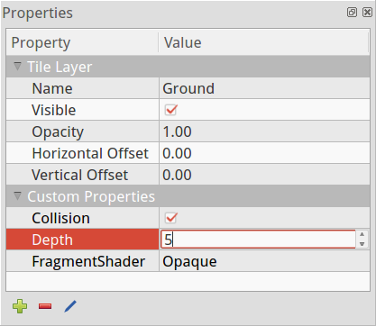
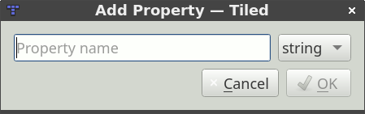
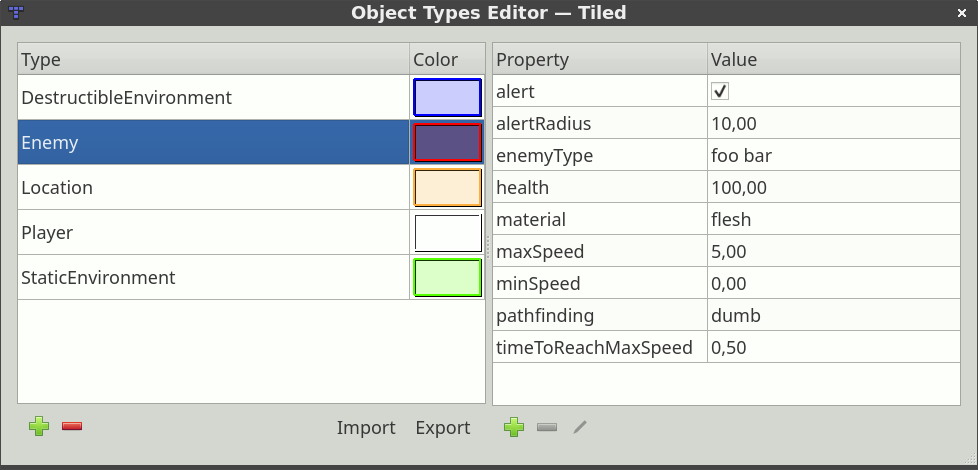

Custom Properties
=================

One of the major strengths of Tiled is that it allows setting custom
properties on all of its basic data structures. This way it is possible
to include many forms of custom information, which can later be used by
your game or by the framework you're using to integrate Tiled maps.

Custom properties are displayed in the Properties view. This view is
context-sensitive, usually displaying the properties of the last
selected object. For tiles in a tileset or objects on an object layer,
it also supports multi-selection.

   Properties View

Adding Properties
-----------------

When you add a property (using the '+' button at the bottom of the
Properties view), you are prompted for its name and its type. Currently
Tiled supports the following basic property types:

-  **string** (any text, including multi-line text)
-  **float** (a floating point number)
-  **int** (a whole number)
-  **bool** (true or false)
-  **file** (a relative path referencing a file)
-  **color** (a 32-bit color value)

   Add Property Dialog

The property type is used to choose a custom editor in the Properties
view. Choosing a number or boolean type also avoids that the value will
get quoted in JSON and Lua exports.

.. raw:: html

   
Since Tiled 1.0

.. _tile-property-inheritance:

Tile Property Inheritance
-------------------------

When custom properties are added to a tile, these properties will also
be visible when an object instance of that tile is selected. This
enables easy per-object overriding of certain default properties
associated with a tile. This becomes especially useful when combined
with :ref:`typed-tiles`.

Inherited properties will be displayed in gray (disabled text color),
whereas overridden properties will be displayed in black (usual text
color).

.. _predefining-properties:

Predefining Properties
----------------------

General Setup
~~~~~~~~~~~~~

Usually you only use a limited set of object types in your game, and
each type of object has a fixed set of possible properties, with
specific types and default values. To save you time, Tiled allows
predefining these properties based on the "Type" field for objects. You
can set this up using the Object Types Editor, available from the *View*
menu.

   Object Types Editor

By default, Tiled stores these object types in the user settings.
However, since you'll often want to share them with other people in your
project, you can export your object types or change the storage location
of the object types file. A simple XML or JSON file with
self-explanatory contents is used to store your object types.

The color not only affects the rendering of the various shapes of
objects, but is also the color of the label which will show up if you
give your object a name.

To make the predefined properties show up in the Properties view, all
you need to do is to enter the name of the type in the built-in "Type"
property. Usually this is what you're doing already anyway to tell your
engine what kind of object it is dealing with.

.. raw:: html

   
Since Tiled 1.0

.. _typed-tiles:

Typed Tiles
~~~~~~~~~~~

If you're using :ref:`tile objects <insert-tile-tool>`, you can set the
type on the tile to avoid having to set it on each object instance.
Setting the type on the tile makes the predefined properties visible
when having the tile selected, allowing to override the values. It also
makes those possibly overridden values visible when having a tile object
instance selected, again allowing you to override them.

An example use-case for this would be to define custom types like "NPC",
"Enemy" or "Item" with properties like "name", "health" or "weight". You
can then specify values for these on the tiles representing these
entities. And when placing those tiles as objects, you can override
those values if you need to.

.. topic:: Future Extensions
   :class: future

   There are several types of custom properties I'd like to add:

   -  **Enumerations**, where you can predefine all possible values and it
      forms a combo box
      (`#1211 <https://github.com/bjorn/tiled/issues/1211>`__).
   -  **Object references**, which would allow easily linking objects
      together and Tiled could display such connections
      (`#707 <https://github.com/bjorn/tiled/issues/707>`__).
   -  **Array properties**, which would be properties having a list of
      values (`#1493 <https://github.com/bjorn/tiled/issues/1493>`__).
   -  **Dictionary properties**, which would be properties that can contain
      any number of other properties as children
      (`#489 <https://github.com/bjorn/tiled/issues/489>`__).

   It would also be nice to add support for **limiting property values**,
   like the length of string properties or a minimum/maximum on number
   values.

   Apart from predefining properties based on object type, I'd like to add
   support for **predefining the properties for each data type**. So
   defining which custom properties are valid for maps, tilesets, layers,
   etc. (`#1410 <https://github.com/bjorn/tiled/issues/1410>`__)

   Finally, the predefined properties would work very well together with
   explicit **support for projects**. Then you could switch between
   different projects or get started on an existing project, without
   needing to configure Tiled to use the right object type definitions.

   If you like any of these plans, please help me getting around to it
   faster by `becoming a patron <https://www.patreon.com/bjorn>`__. The
   more support I receive the more time I can afford to spend improving
   Tiled!
