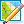

Editing Tile Layers
===================

:ref:`tile-layer-introduction` are what makes Tiled a *tile map editor*.
Although not as flexible as :ref:`object-layer-introduction`, they provide
efficient data storage and good rendering performance as well as efficient
content creation. Every new map gets one by default, though feel free to delete
it when you're not going to use it.

.. _stamp-tool:

Stamp Brush
-----------

Shortcut: ``B`` |stock-tool-clone|

The primary tool for editing tile layers is the Stamp Brush. It can be
used to paint single tiles as well as larger "stamps", which is where it
gets its name from. Using the right mouse button, it can also quickly
capture tile stamps from the currently active layer. A tile stamp is
commonly created by selecting one or more tiles in the Tilesets view.

The Stamp Brush has some extra features:

-  While holding ``Shift``, click any two points to draw a line between
   them.

-  While holding ``Ctrl+Shift``, click any two points two draw a circle
   or ellipse centered on the first point.

-  Activate the *Random Mode* using the dice button on the Tool Options
   toolbar to have the Stamp Brush paint with random tiles from the tile
   stamp. The probability of each tile depends on how often it occurred
   on the tile stamp, as well as the probability set on each tile in the
   *Tileset Editor*.

-  Activate the *Terrain Fill Mode* using the Terrain tile |terrain| button on
   the tool bar to have the Stamp Brush paint using random terrain tiles. This makes
   adjacent tiles match edge and corner terrains to be placed. Terrain tiles are
   described in detail in :doc:`terrain`.

-  In combination with the *Tile Stamps* view, it can also place
   randomly from a set of predefined tile stamps. This can be more
   useful than the *Random Mode*, which randomly places individual
   tiles.

-  You can flip the current tile stamp horizontally/vertically by using
   ``X`` and ``Y`` respectively. You can also rotate left/right by
   using ``Z`` and ``Shift+Z`` respectively. These actions can also be
   triggered from the Tool Options tool bar.

.. _terrain-tool:

Terrain Brush
-------------

Shortcut: ``T`` |terrain-edit|

The Terrain Brush allows for efficient editing with certain types of terrain
transitions (corner-based, edge-based or a combination). Setting it up
requires associating terrain information with your tiles, which is described
in detail in :doc:`terrain`.

Similarly to the :ref:`stamp-tool`, you can draw lines by holding ``Shift``.
When holding ``Ctrl``, the size of the edited area is increased to cover an
entire tile rather than just one corner or edge.

.. raw:: html

   
Since Tiled 1.0

When holding ``Alt``, the editing operations are also applied at a 180
degree rotation. This is especially useful when editing strategic maps
where two sides need to have equal opportunities. The modifier works
well in combination with either ``Shift`` for drawing lines or ``Ctrl``
for increasing the edited area.

.. raw:: html

   
Since Tiled 1.1

.. _bucket-fill-tool:

Bucket Fill Tool
----------------

Shortcut: ``F`` |stock-tool-bucket-fill|

The Bucket Fill Tool provides a quick way of filling empty areas or
areas covered with the same tiles. The currently active tile stamp will
be repeated in the filled area. It can also be used in combination with
the *Random Mode*, or *Terrain Fill Mode*.

When holding ``Shift``, the tool fills the currently selected area
regardless of its contents. This is useful for filling custom areas that
have been selected previously using one or more :ref:`tile-selection-tools`.

You can also flip and rotate the current stamp as described for the
:ref:`stamp-tool`.

.. raw:: html

   
Since Tiled 1.1

.. _shape-fill-tool:

Shape Fill Tool
---------------

Shortcut: ``P`` |rectangle-fill|

This tool provides a quick way to fill rectangles or ellipses with a certain
tile or pattern.

- Holding ``Shift`` fills an exact square or circle.

.. raw:: html

   
Since Tiled 1.10.2

- Holding ``Alt`` draws the rectangle or ellipse centered around the starting
  location.

You can also flip and rotate the current stamp as described for the
:ref:`stamp-tool`.

.. _eraser-tool:

Eraser
------

Shortcut: ``E`` |stock-tool-eraser|

A simple eraser tool. Left click erases single tiles and right click can
be used to quickly erase rectangular areas.

.. raw:: html

   
Since Tiled 1.5

-  Holding ``Shift`` erases on all layers.

.. _tile-selection-tools:

Selection Tools
---------------

There are various tile selection tools that all work in similar fashion:

-  |stock-tool-rect-select| **Rectangular Select** allows selection of
   rectangular areas (shortcut: ``R``)

-  |stock-tool-fuzzy-select-22| **Magic Wand** allows selection of connected
   areas filled with the same tile (shortcut: ``W``)

-  |stock-tool-by-color-select| **Select Same Tile** allows selection of
   same-tiles across the entire layer (shortcut: ``S``)

By default, each of these tools replaces the currently selected area.
The following modifiers can be used to change this behavior:

-  Holding ``Shift`` expands the current selection with the new area
-  Holding ``Ctrl`` subtracts the new area from the current selection
-  Holding ``Ctrl`` and ``Shift`` selects the intersection of the new
   area with the current selection

You can also lock into one of these modes (Add, Subtract or Intersect)
by clicking on one of the tool buttons in the Tool Options toolbar.

Managing Tile Stamps
--------------------

It can often be useful to store the current tile stamp somewhere to use
it again later. The following shortcuts work for this purpose:

-  ``Ctrl + 1-9`` - Store current tile stamp. When no tile drawing tool is
   selected, tries to capture the current tile selection (similar to
   ``Ctrl + C``).
-  ``1-9`` - Recall the stamp stored at this location (similar to
   ``Ctrl + V``)

Tile stamps can also be stored by name and extended with variations
using the *Tile Stamps* view.

.. |stock-tool-bucket-fill| image:: ../../src/tiled/resources/images/22/stock-tool-bucket-fill.png

.. |stock-tool-rect-select| image:: ../../src/tiled/resources/images/22/stock-tool-rect-select.png

.. |stock-tool-fuzzy-select-22| image:: ../../src/tiled/resources/images/22/stock-tool-fuzzy-select-22.png

.. |terrain| image:: ../../src/tiled/resources/images/24/terrain.png
