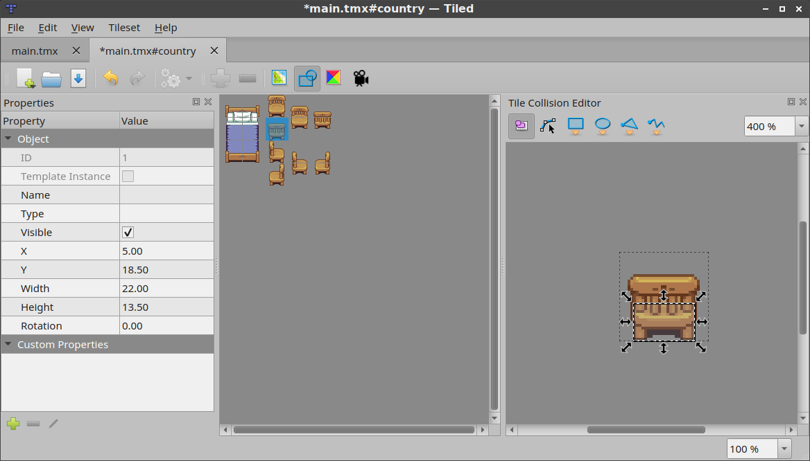
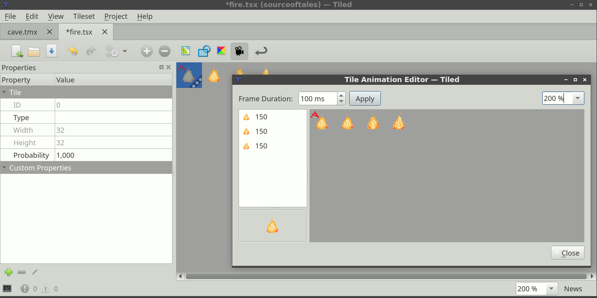

Editing Tilesets
================

To edit a tileset it needs to be opened explicitly for editing. External
tilesets can be opened via the *File* menu, but in general the quickest
way to edit the tileset when it is already open in the *Tilesets* view
is to click the small *Edit Tileset* button in the tool bar below the
tileset.

Two Types of Tileset
--------------------

A tileset is a collection of tiles. Tiled currently supports two types
of tilesets, which are chosen when creating a new tileset:

Based on Tileset Image
   This tileset defines a fixed size for all tiles and the image from
   which these tiles are supposed to be cut. In addition it supports a
   margin around the tiles and a spacing between the tiles, which
   allows for using tileset images that either happen to have space
   between or around their tiles or those that have extruded the border
   pixels of each tile to avoid color bleeding.

Collection of Images
   In this type of tileset each tile refers to its own image file. It
   is useful when the tiles aren't the same size, or when the packing
   of tiles into a texture is done later on.

Regardless of the type of tileset, you can associate a lot of meta-
information with it and its tiles. Some of this information can be for
use in your game, like :ref:`collision information <tile-collision-editor>`
and :ref:`animations <tile-animation-editor>`. Other information is
primarily meant for certain editing tools.

.. note::

   A tileset can be either embedded in a map file or saved externally.
   Since Tiled 1.0, the default and recommended approach is to save your
   tilesets to their own file. This simplifies your workflow since it
   makes sure any meta-information is shared between all maps using the
   same tileset.

Tileset Properties
------------------

You can access the tileset properties by using the menu action
*Tileset > Tileset Properties*.

Name
   The name of the tileset. Used to identify the tileset in the
   *Tilesets* view when editing a map.

Drawing Offset
   A drawing offset in pixels, applied when rendering any tile from
   the tileset (as part of tile layers or as tile objects). This is
   can be useful to make your tiles align to the grid.

Background Color
   A background color for the tileset, which can be set in case the
   default dark-gray background is not suitable for your tiles.

.. raw:: html

   
New in Tiled 1.0

Orientation
   When the tileset contains isometric tiles, you can set this to
   *Isometric*. This value, along with the **Grid Width** and
   **Grid Height** properties, is taken into account by overlays
   rendered on top of the tiles. This helps for example when specifying
   :ref:`terrain-information` or editing :ref:`wang-sets`. It also
   affects the orientation used by the :ref:`tile-collision-editor`.

Columns
   This is a read-only property for tilesets based on a tileset image,
   but for image collection tilesets you can control the number of
   columns used when displaying the tileset here.

Image
   This property only exists for tilesets based on a tileset image.
   Selecting the value field will show an *Edit...* button, allowing
   you to change the parameters relevant to cutting the tiles from the
   image.

Of course, as with most data types in Tiled, you can also associate
:doc:`custom-properties` with the tileset.

Tile Properties
---------------

ID
   The ID of the tile in the tileset (read-only)

.. raw:: html

   
New in Tiled 1.0

Type
   This property refers to custom types defined in the :ref:`Object Types Editor <predefining-properties>`.
   See the section about :ref:`typed-tiles` for more information.

Width and Height
   The size of the tile (read-only)

Probability
   Represents a relative probability that this tile will get chosen out
   of multiple options. This value is used in *Random Mode* and by the
   :ref:`terrain-tool`.

Image
   Only relevant for tiles that are part of image collection tilesets,
   this shows the image file of the tile and allows you to change it.

.. _terrain-information:

Terrain Information
-------------------

Terrain information can be added to a tileset to enable the use of the
the :ref:`terrain-tool`. See the section about
:ref:`defining terrain information <define-terrain-information>`.

.. raw:: html

   
New in Tiled 1.1

.. _wang-sets:

Wang Sets
---------

A tileset can contain any number of Wang sets for use with the
:ref:`wang-tool`. See :ref:`defining-wang-tile-info` for more
information.

.. _tile-collision-editor:

Tile Collision Editor
---------------------

The tile collision editor is available by clicking the *Tile Collision Editor*
|tile-collision-editor-icon| button on the tool bar. This will open a
view where you can create and edit shapes on the tile. You can also
associate custom properties with each shape.

Usually these shapes define collision information for a certain sprite
or for a tile representing level geometry, but of course you could also
use them to add certain hot-spots to your sprites like for particle
emitters or the source of gunshots.

   Tile Collision Editor

.. note::

   Check out the `Tiled2Unity`_ tool by Sean Barton for a great example of
   what you can do with this information. It can take the collision shapes
   for all tiles and generate a single collision mesh from it, as
   demonstrated in the `Mega Dad Adventures`_ post.

.. _tile-animation-editor:

Tile Animation Editor
---------------------

The tile animation editor allows defining a single linear looping
animation with each tile by referring to other tiles in the tileset as
its frames. Open it by clicking the *Tile Animation Editor* |tile-animation-editor-icon| button.

Tile animations can be live-previewed in Tiled, which is useful for
getting a feeling of what it would look like in-game. The preview can be
turned on or off via *View > Show Tile Animations*.

   Tile Animation Editor

The following steps allow to add or edit a tile animation:

* Select the tile in the main Tiled window. This will make the *Tile Animation Editor*
  window show the (initially empty) animation associated with that tile,
  along with all other tiles from the tileset.

* Drag tiles from the tileset view in the Tile Animation Editor into the
  list on the left to add animation frames. You can drag multiple tiles at
  the same time. Each new frame gets a default duration of 100 ms.

* Double-click on the duration of a frame to change it.

* Drag frames around in the list to reorder them.

A preview of the animation shows in the bottom left corner.

.. _Tiled2Unity: http://www.seanba.com/Tiled2Unity
.. _Mega Dad Adventures: http://www.seanba.com/megadadadventures.html

.. topic:: Future Extensions
   :class: future

   There are many ways in which the tileset editor can be made more
   efficient, for example:

   **Wang Sets**

   - Make it easier to set up Wang tiles (`#1729 <https://github.com/bjorn/tiled/issues/1729>`__)

   **Tile Collision Editor**

   - Allow setting collisions for multiple tiles at once (`#1322 <https://github.com/bjorn/tiled/issues/1322>`__)
   - Render tile collision shapes to the main map (`#799 <https://github.com/bjorn/tiled/issues/799>`__)
     or to the tileset view (`#1281 <https://github.com/bjorn/tiled/issues/1281>`__)

   **Tile Animation Editor**

   - Allow changing the default frame duration (`#1631 <https://github.com/bjorn/tiled/issues/1631>`__)
   - Allow changing the duration of multiple frames at the same time (`#1310 <https://github.com/bjorn/tiled/issues/1310>`__)
   - Support multiple named animations per tile (`#986 <https://github.com/bjorn/tiled/issues/986>`__)

   If you like any of these plans, please help me getting around to it
   faster by `becoming a patron <https://www.patreon.com/bjorn>`__. The
   more support I receive the more time I can afford to spend improving
   Tiled!
