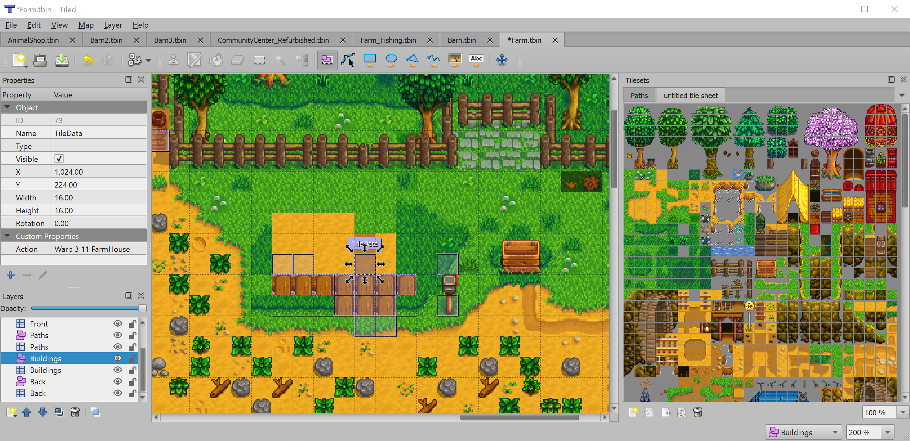

.. raw:: html

   
tBIN since Tiled 1.1

   
tIDE since Tiled 1.12

tBIN and tIDE
-------------

The tBIN map format is a binary format used by the `tIDE Tile Map Editor`_,
while the tIDE map format is an XML-based format by it as well.
tIDE was used by `Stardew Valley`_, a successful game that spawned many
`community mods <https://www.nexusmods.com/stardewvalley/?>`__.

Tiled ships with a plugin that enables direct editing of Stardew Valley
maps (and any other maps using the tBIN or tIDE formats). This plugin needs to
be enabled in *Edit > Preferences > Plugins*. It is not enabled by default
because it won't store everything (most notably it doesn't support
object layers in general, nor external tilesets), so you need to know
what you are doing.

.. note::

   There is only one plugin, called `tbin`. Despite its name, it enables 
   support for both tBIN and tIDE maps.

.. note::

   The tBIN and tIDE formats support setting custom properties on the tiles of
   a tile layer. Since Tiled does not support this directly, "TileData"
   objects are created that match the location of the tile, on which
   such properties are then stored.

   One of the farm maps from Stardew Valley opened in Tiled.

.. _tIDE Tile Map Editor: https://colinvella.github.io/tIDE/
.. _Stardew Valley: https://stardewvalley.net/
