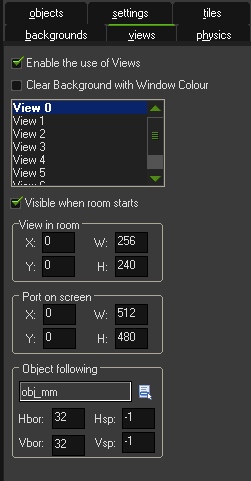

Export Formats
==============

While there are many :doc:`libraries and frameworks </reference/support-for-tmx-maps>`
that work directly with Tiled maps, Tiled also supports a number of
additional file and export formats.

Exporting can be done by clicking *File > Export*. When triggering the
menu action multiple times, Tiled will only ask for the file name the
first time. Exporting can also be automated using the ``--export-map``
command-line parameter.

.. note::

   When exporting on the command-line on Linux, Tiled will still need an
   X server to run. To automate exports in a headless environment, you
   can use a headless X server such as `Xvfb`_. In this case you would
   run Tiled from the command-line as follows:

   ::

      xvfb-run tiled --export-map ...

JSON
----

:doc:`The JSON format </reference/json-map-format>` is most common
additional file format supported by Tiled. It can be used instead of TMX
since Tiled can also open JSON maps and tilesets and the format supports
all Tiled features. Especially in the browser and when using JavaScript
in general, the JSON format is easier to load.

The JSON format is currently the only additional format supported for
tilesets.

.. _lua-export:

Lua
---

Maps can be exported to Lua code. This export option supports most of
Tiled's features and is useful when using a Lua-based framework like
`LÖVE`_ (with `Simple Tiled Implementation`_), `Corona`_ (with
`ponytiled`_ or `Dusk Engine`_) or `Defold`_.

Currently not included are the type of custom properties (though the
type does affect how a property value is exported) and information
related to recent features like :doc:`Wang tiles <using-wang-tiles>` and
:doc:`object templates <using-templates>`.

CSV
---

The CSV export only supports :doc:`tile layers <editing-tile-layers>`.
Maps containing multiple tile layers will export as multiple files,
called ``base_<layer-name>.csv``.

Each tile is written out by its ID, unless the tile has a custom
property called ``name``, in which case its value is used to write out
the tile. Using multiple tilesets will lead to ambiguous IDs, unless the
custom ``name`` property is used. Empty cells get the value ``-1``.

.. _gamemaker-export:

GameMaker: Studio 1.4
---------------------

GameMaker: Studio 1.4 uses a custom XML-based format to store its rooms,
and Tiled ships with a plugin to export maps in this format. Currently
only orthogonal maps will export correctly.

Tile layers and tile objects (when no type is set) will export as "tile"
elements. These support horizontal and vertical flipping, but no
rotation. For tile objects, scaling is also supported.

.. warning::

   The tilesets have to be named the same as the corresponding backgrounds
   in the GameMaker project. Otherwise GameMaker will pop up an error for each
   tile while loading the exported ``room.gmx`` file.

Object Instances
~~~~~~~~~~~~~~~~

GameMaker object instances are created by putting the object name in the
"Type" field of the object in Tiled. Rotation is supported here, and for
tile objects also flipping and scaling is supported (though flipping in
combination with rotation doesn't appear to work in GameMaker).

.. raw:: html

   
New in Tiled 1.1

The following custom properties can be set on objects to affect the
exported instance:

* string ``code`` (instance creation code, default: "")
* float ``scaleX`` (default: derived from tile or 1.0)
* float ``scaleY`` (default: derived from tile or 1.0)
* int ``originX`` (default: 0)
* int ``originY`` (default: 0)

The ``scaleX`` and ``scaleY`` properties can be used to override the
scale of the instance. However, if the scale is relevant then it will
generally be easier to use a tile object, in which case it is
automatically derived from the tile size and the object size.

The ``originX`` and ``originY`` properties can be used to tell Tiled
about the origin of the object defined in GameMaker, as an offset from
the top-left. This origin is taken into account when determining the
position of the exported instance.

.. hint::

   Of course setting the type and/or the above properties manually for
   each instance will get old fast. Since Tiled 1.0.2, you can instead
   use tile objects with the type set on the tile, and in Tiled 1.1 you
   can also use :doc:`object templates <using-templates>`.

.. raw:: html

   
New in Tiled 1.1

Views
~~~~~

Views can be defined using :ref:`rectangle objects <insert-rectangle-tool>`
where the Type has been set to ``view``. The position and size will be
snapped to pixels. Whether the view is visible when the room starts
depends on whether the object is visible. The use of views is
automatically enabled when any views are defined.

The following custom properties can be used to define the various other
properties of the view:

**Port on screen**

* int ``xport`` (default: 0)
* int ``yport`` (default: 0)
* int ``wport`` (default: 1024)
* int ``hport`` (default: 768)

**Object following**

* string ``objName``
* int ``hborder`` (default: 32)
* int ``vborder`` (default: 32)
* int ``hspeed`` (default: -1)
* int ``vspeed`` (default: -1)

.. hint::

   When you're defining views in Tiled, it is useful to add ``view``
   as object type in the :ref:`Object Types Editor <predefining-properties>`,
   adding the above properties for ease of access. If you frequently use
   views with similar settings, you can set up
   :doc:`templates <using-templates>` for them.

Map Properties
~~~~~~~~~~~~~~

General
^^^^^^^

* int ``speed`` (default: 30)
* bool ``persistent`` (default: false)
* bool ``clearDisplayBuffer`` (default: true)
* bool ``clearViewBackground`` (default: false)
* string ``code`` (map creation code, default: "")

Physics
^^^^^^^

* bool ``PhysicsWorld`` (default: false)
* int ``PhysicsWorldTop`` (default: 0)
* int ``PhysicsWorldLeft`` (default: 0)
* int ``PhysicsWorldRight`` (default: width of map in pixels)
* int ``PhysicsWorldBottom`` (default: height of map in pixels)
* float ``PhysicsWorldGravityX`` (default: 0.0)
* float ``PhysicsWorldGravityY`` (default: 10.0)
* float ``PhysicsWorldPixToMeters`` (default: 0.1)

Layer Properties
~~~~~~~~~~~~~~~~

Both tile layers and object layers may produce "tile" elements in the exported
room file. Their depth is set automatically, with tiles from the bottom-most
layer getting a value of 10000000 (the GameMaker default) and counting up from
there. If you want to set a custom depth value you can set the following
property on the layer:

* int ``depth`` (default: 10000000 + N)

.. raw:: html

   
New in Tiled 1.1

tBIN
----

The tBIN map format is a binary format used by the `tIDE Tile Map Editor`_.
tIDE was used by `Stardew Valley`_, a successful game that spawned many
`community mods <https://www.nexusmods.com/stardewvalley/?>`__.

Tiled ships with a plugin that enables direct editing of Stardew Valley
maps (and any other maps using the tBIN format). This plugin needs to be
enabled in *Edit > Preferences > Plugins*. It is not enabled by default
because it won't store everything (most notably it doesn't support
object layers in general, nor external tilesets), so you need to know
what you are doing.

.. warning::

   The tBIN format supports setting custom properties on the tiles of a
   tile layer. Since Tiled does not support this directly, "TileData"
   objects are created that match the location of the tile, on which
   such properties are then stored. Care should be taken to keep these
   objects aligned to the grid for the saving to work correctly.

Defold
------

Tiled can export a map to a `Defold Tile Map <https://www.defold.com/manuals/2dgraphics/#_tile_maps>`__ (\*.tilemap).
This component only supports tile layers and only a single tileset may be used.
The plugin is disabled by default.

Upon export, the ``tile_set`` property of the Tile Map is left empty, so
it will need to be set up in Defold after each export.

When any additional information from the map is needed, the map can be
exported in :ref:`Lua format <lua-export>` and loaded as Defold script.

Other Formats
-------------

A few other plugins ship with Tiled to support various games:

droidcraft
    Adds support for editing `DroidCraft <https://play.google.com/store/apps/details?id=org.me.droidcraft>`__ maps (\*.dat)
flare
    Adds support for editing `Flare Engine <http://flarerpg.org/>`__ maps (\*.txt)
replicaisland
    Adds support for editing `Replica Island <http://replicaisland.net/>`__ maps (\*.bin)
tengine
    Adds support for exporting to `T-Engine4 <https://te4.org/te4>`__ maps (\*.lua)

These plugins are disabled by default. They can be enabled in *Edit > Preferences > Plugins*.

Python Scripts
~~~~~~~~~~~~~~

It is also possible to write :doc:`Python scripts <python>` to add
support for importing or exporting custom map formats.

.. _LÖVE: https://love2d.org/
.. _Corona: https://coronalabs.com/
.. _Defold: https://www.defold.com/
.. _Simple Tiled Implementation: https://github.com/karai17/Simple-Tiled-Implementation
.. _ponytiled: https://github.com/ponywolf/ponytiled
.. _Dusk Engine: https://github.com/GymbylCoding/Dusk-Engine
.. _tIDE Tile Map Editor: https://colinvella.github.io/tIDE/
.. _Stardew Valley: https://stardewvalley.net/
.. _The Mana World: https://www.themanaworld.org/
.. _Xvfb: https://www.x.org/archive/X11R7.6/doc/man/man1/Xvfb.1.xhtml
