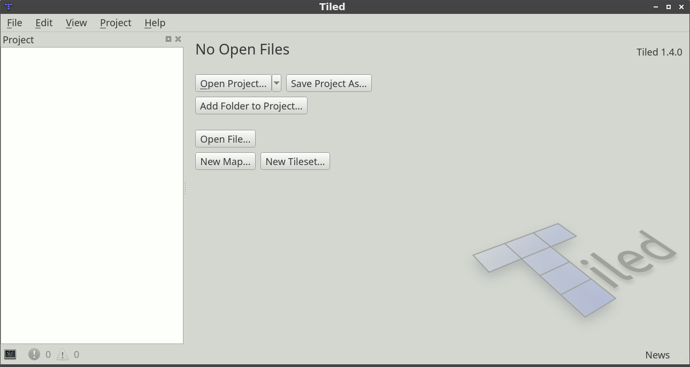
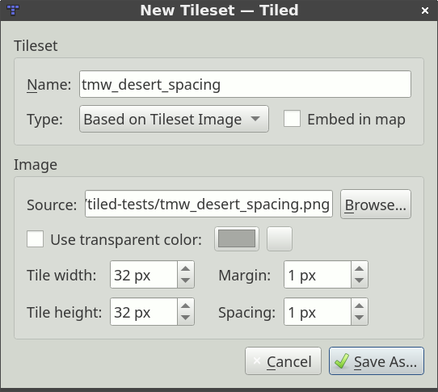
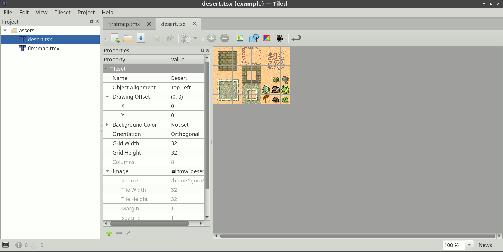
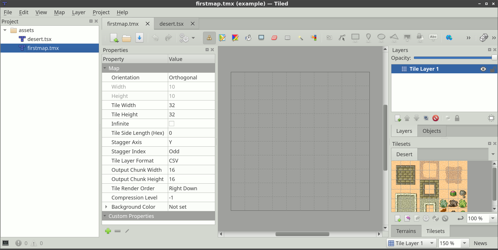

Introduction
============

About Tiled
-----------

**Tiled is a 2D level editor that helps you develop the content of your
game. Its primary feature is to edit tile maps of various forms, but it
also supports free image placement as well as powerful ways to annotate
your level with extra information used by the game. Tiled focuses on
general flexibility while trying to stay intuitive.**

In terms of tile maps, it supports straight rectangular tile layers, but
also projected isometric, staggered isometric and staggered hexagonal
layers. A tileset can be either a single image containing many tiles, or
it can be a collection of individual images. In order to support certain
depth faking techniques, tiles and layers can be offset by a custom
distance and their rendering order can be configured.

The primary tool for editing :ref:`tile layers <tile-layer-introduction>`
is a stamp brush that allows efficient painting and copying of tile
areas. It also supports drawing lines and circles. In addition, there
are several selection tools and a tool that does :doc:`automatic terrain transitions <using-the-terrain-tool>`.
Finally, it can apply changes based on :doc:`pattern-matching <automapping>`
to automate parts of your work.

Tiled also supports :ref:`object layers <object-layer-introduction>`,
which traditionally were only for annotating your map with information
but more recently they can also be used to place images. You can add
rectangle, point, ellipse, polygon, polyline and tile objects. Object placement
is not limited to the tile grid and objects can also be scaled or
rotated. Object layers offer a lot of flexibility to add almost any
information to your level that your game needs.

Other things worth mentioning are the support for adding custom map or
tileset formats through plugins, the tile stamp memory, tile animation
support and the tile collision editor.

.. _getting-started:

Getting Started
---------------

Creating a New Map
~~~~~~~~~~~~~~~~~~

When launching Tiled for the first time, we are greeted with the
following window:

   Tiled Window

The first thing we'll do is to start a new map with *File -> New -> New
Map…* (``Ctrl+N``). The following dialog will pop up:

.. figure:: images/introduction/tiled-new-map.png
   :alt: New Map
   :scale: 66

   New Map

Here, we choose the initial map size, tile size, orientation, tile layer
format, tile render order (only supported for *Orthogonal* maps) and whether
the map is :doc:`infinite <using-infinite-maps>` or not. All of these things
can be changed later as needed, so it's not important to get it all right the
first time.

After saving our map, we'll see the tile grid and an initial tile layer
will be added to the map. However, before we can start using any tiles
we need to add a tileset. Choose *File -> New -> New Tileset…* to open the
New Tileset dialog:

   New Tileset

Click the *Browse…* button and select the ``tmw_desert_spacing.png``
tileset from the examples shipping with Tiled (or use one of your own if
you wish). This example tileset uses a tile size of 32x32. It also has a
one pixel *margin* around the tiles and a one pixel *spacing* in between
the tiles (this is pretty rare actually, usually you should leave these
values on 0).

.. note::

   We leave the *Embed in map* option disabled. This is recommended,
   since it will allow the tileset to be used by multiple maps without
   setting up its parameters again. It will also be good to store the
   tileset in its own file if you later add tile properties, terrain
   definitions, collision shapes, etc., since that information is then
   shared between all your maps.

After saving the tileset, Tiled should look as follows:

   Tileset Created

Since we don't want to do anything else with the tileset for now, just
switch back to the map file:

   Tileset Usable on the Map

We're ready to select some tiles and start painting! But first, let's
have a quick look at the :doc:`various layer types <layers>` supported
by Tiled.

.. note::

   Much of the manual still needs to be written. Fortunately, there is a
   very nice `Tiled Map Editor Tutorial Series`_ on GamesFromScratch.com.
   In addition, the support for Tiled in various :doc:`engines and frameworks </reference/support-for-tmx-maps>`
   often comes with some usage information.

.. _Tiled Map Editor Tutorial Series: http://www.gamefromscratch.com/post/2015/10/14/Tiled-Map-Editor-Tutorial-Series.aspx
