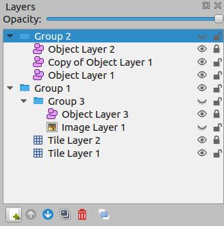
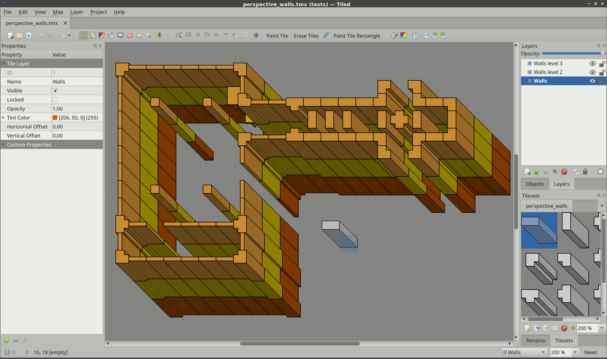

Working with Layers
===================

A Tiled map supports various sorts of content, and this content is
organized into various different layers. The most common layers are the
`Tile Layer <#tile-layers>`__ and the `Object Layer <#object-layers>`__.
There is also an `Image Layer <#image-layers>`__ for including simple
foreground or background graphics. The order of the layers determines
the rendering order of your content.

Layers can be hidden, made only partially visible and can be locked. Layers
also have an offset and a :ref:`parallax scrolling factor <parallax-factor>`,
which can be used to position them independently of each other, for example to
fake depth. Finally their contents can be tinted by multiplying with a custom
:ref:`tint color <tint-color>`.

   The eye and lock icon toggle the visibility and locked state of a
   layer respectively.

You use `Group Layers <#group-layers>`__ to organize the layers into a
hierarchy. This makes it more comfortable to work with a large amount of
layers.

Layer Types
-----------

.. _tile-layer-introduction:

Tile Layers
~~~~~~~~~~~

Tile layers provide an efficient way of storing a large area filled with
tile data. The data is a simple array of tile references and as such no
additional information can be stored for each location. The only extra
information stored are a few flags, that allow tile graphics to be
flipped vertically, horizontally or anti-diagonally (to support rotation
in 90-degree increments).

The information needed to render each tile layer is stored with the map,
which specifies the position and rendering order of the tiles based on
the orientation and various other properties.

Despite only being able to refer to tiles, tile layers can also be
useful for defining various bits of non-graphical information in your
level. Collision information can often be conveyed using a special
tileset, and any kind of object that does not need custom properties and
is always aligned to the grid can also be placed on a tile layer.

.. _object-layer-introduction:

Object Layers
~~~~~~~~~~~~~

Object layers are useful because they can store many kinds of
information that would not fit in a tile layer. Objects can be freely
positioned, resized and rotated. They can also have individual custom
properties. There are many kinds of objects:

-  **Rectangle** - for marking custom rectangular areas
-  **Ellipse** - for marking custom ellipse or circular areas
-  **Point** - for marking exact locations (since Tiled 1.1)
-  **Polygon** - for when a rectangle or ellipse doesn't cut it (often a
   collision area)
-  **Polyline** - can be a path to follow or a wall to collide with
-  **Tile** - for freely placing, scaling and rotating your tile
   graphics
-  **Text** - for custom text or notes (since Tiled 1.0)

All objects can be named, in which case their name will show up in a
label above them (by default only for selected objects). Objects can
also be given a *class*, which is useful since it can be used to
customize the color of their label and the available :ref:`custom
properties <custom-classes>` for this object. For tile objects, the class
can be :ref:`inherited from their tile <tile-property-inheritance>`.

For most map types, objects are positioned in plain pixels. The only
exception to this are isometric maps (not isometric staggered). For
isometric maps, it was deemed useful to store their positions in a
projected coordinate space. For this, the isometric tiles are assumed to
represent projected squares with both sides equal to the *tile height*.
If you're using a different coordinate space for objects in your
isometric game, you'll need to convert these coordinates accordingly.

The object width and height is also mostly stored in pixels. For
isometric maps, all shape objects (rectangle, point, ellipse, polygon and
polyline) are projected into the same coordinate space described above.
This is based on the assumption that these objects are generally used to
mark areas on the map.

.. _image-layers:

Image Layers
~~~~~~~~~~~~

Image layers provide a way to quickly include a single image as
foreground or background of your map. They currently have limited
functionality and you may consider adding the image as a Tileset instead and
place it as a :ref:`Tile Object <insert-tile-tool>`. This way, you gain the
ability to freely scale and rotate the image.

However, image layers can be repeated along the respective axes through their
*Repeat X* and *Repeat Y* properties.

The other advantage of using an image layer is that it avoids selecting /
dragging the image while using the Select Objects tool. However, since Tiled
1.1 this can also be achieved by locking the object layer containing the tile
object you'd like to avoid interacting with.

.. raw:: html

   
Since Tiled 1.0

.. _group-layers:

Group Layers
~~~~~~~~~~~~

Group layers work like folders and can be used for organizing the layers
into a hierarchy. This is mainly useful when your map contains a large
amount of layers.

The visibility, opacity, offset, lock and :ref:`tint color <tint-color>` of a
group layer affects all child layers.

Layers can be easily dragged in and out of groups with the mouse. The
Raise Layer / Lower Layer actions also allow moving layers in and out of
groups.

.. raw:: html

   
Since Tiled 1.5

.. _parallax-factor:

Parallax Scrolling Factor
-------------------------

The parallax scrolling factor determines the amount by which the layer moves in
relation to the camera.

By default its value is 1, which means its position on the screen changes at
the same rate as the position of the camera (in opposite direction). A lower
value makes it move slower, simulating a layer that is further away, whereas
a higher value makes it move faster, simulating a layer positioned in between
the screen and the camera.

A value of 0 makes the layer not move at all, which can be useful to include
some pieces of your ingame UI or to mark its general viewport boundaries.

Negative values make the layer move in opposite direction, though this is
rarely useful.

When the parallax scrolling factor is set on a group layer, it applies to all
its child layers. The effective parallax scrolling factor of a layer is
determined by multiplying the parallax scrolling factor by the scrolling
factors of all parent layers.

Parallax Reference Point
~~~~~~~~~~~~~~~~~~~~~~~~

To match not only the scrolling speed but also the positioning of layers, we
need to use the same points of reference. In Tiled these are the parallax
origin and the center of the view. The parallax origin is stored per map and
defaults to (0,0), which is the top-left of the maps bounding box. The distance
between these two points is multiplied by the parallax factor to determine the
final position on the screen for each layer. For example:

* If the parallax origin is in the center of the view, the distance is (0,0)
  and none of the parallax factors have any effect. The layers are rendered
  where they would have been, if parallax was disabled.

* Now, when the map is scrolled right by 10 pixels, the distance between the
  parallax origin and the center of the view is 10. So a layer with a parallax
  factor of 0.7 will have moved just ``0.7 * 10 = 7`` pixels.

Quite often, a viewport transform is used to scroll the entire map. In this
case, one may need to adjust the position of each layer to take its parallax
factor into account. Instead of multiplying the distance with the parallax
factor directly, we now multiply by ``1 - parallaxFactor`` to get the layer
position. For example:

* When the camera moves right by 10 pixels, the layer will have moved 10
  pixels to the left (-10), so by positioning the layer at
  ``10 * (1 - 0.7) = 3``, we're making sure that it only moves 7 pixels to
  the left.

.. raw:: html

   
Since Tiled 1.4

.. _tint-color:

Tinting Layers
--------------

When you set the *Tint Color* property of a layer, this affects the way images
are rendered. This includes tiles, tile objects and the image of an
:ref:`Image Layer <image-layers>`.

Each pixel color value is multiplied by the tint color. This way you can
darken or colorize your graphics in various ways without needing to set up
separate images for it.

   A gray tileset rendered in a different color for each layer.

The tint color can also be set on a :ref:`Group Layer <group-layers>`, in
which case it is inherited by all layers in the group.

.. topic:: Future Extensions
   :class: future

   There are many ways in which the layers can be made more powerful:

   -  Ability to lock individual objects
      (`#828 <https://github.com/bjorn/tiled/issues/828>`__).
   -  Moving certain map-global properties to the Tile Layer
      (`#149 <https://github.com/bjorn/tiled/issues/149>`__). It would be
      useful if one map could accommodate layers of different tile sizes
      and maybe even of different orientation.

   If you like any of these plans, please help me getting around to it
   faster by `sponsoring Tiled development <https://www.mapeditor.org/donate>`__. The
   more support I receive the more time I can afford to spend improving
   Tiled!
