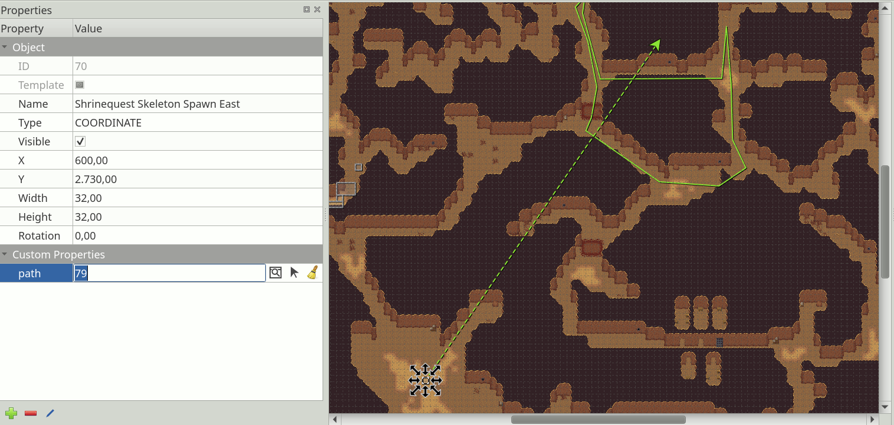

Working with Objects
====================

Using objects you can add a great deal of information to your map for
use in your game. They can replace tedious alternatives like hardcoding
coordinates (like spawn points) in your source code or maintaining
additional data files for storing gameplay elements.

By using *tile objects*, objects of various types can be made easy to
recognize or they can be used for purely graphical purposes. In some cases
they can replace the use of tile layers entirely, as demonstrated by the
"Sticker Knight" example shipping with Tiled.

All objects can have :doc:`custom properties <custom-properties>`, which can
also be used to create :ref:`connections between objects
<connecting-objects>`.

To start using objects, add an :ref:`Object Layer <object-layer-introduction>`
to your map.

Placement Tools
---------------

Each type of object has its own placement tool.

.. raw:: html

   
Since Tiled 1.2

A preview is shown of the object you're about to place when you hover
over the map. While placing an object, you can press ``Escape`` or
right-click to cancel placement of the object. Press ``Escape`` again
to switch to the :ref:`select-objects-tool` tool.

.. _insert-rectangle-tool:

Insert Rectangle
~~~~~~~~~~~~~~~~

Shortcut: ``R``

The rectangle was the first type of object supported by Tiled, which is why
objects are rectangles by default in the :doc:`/reference/tmx-map-format`. They
are useful for marking rectangular areas and assigning custom properties to
them. They are also often used for specifying collision boxes.

Place a rectangle by clicking-and-dragging in any direction. Holding
``Shift`` makes it square and holding ``Ctrl`` snaps its size to the
tile size.

Rectangle objects have their origin in the top-left. However, if the rectangle
is empty (width and height are both 0), it is rendered as a small square
around its position. This is mainly to keep it visible and selectable.

.. raw:: html

   
Since Tiled 1.1

.. _insert-point-tool:

Insert Point
~~~~~~~~~~~~~~

Shortcut: ``I``

Points are the simplest objects you can place on a map. They only represent a
location, and cannot be resized or rotated. Simply click on the map to position
a point object.

.. _insert-ellipse-tool:

Insert Ellipse
~~~~~~~~~~~~~~

Shortcut: ``C``

Ellipses work the same way as `rectangles <#insert-rectangle>`__, except
that they are rendered as an ellipse. Useful for when your area or
collision shape needs to represent a circle or ellipse.

.. _insert-polygon-tool:

Insert Polygon
~~~~~~~~~~~~~~

Shortcut: ``P``

Polygons are the most flexible way of defining the shape of an area.
They are most commonly used for defining collision shapes.

When placing a polygon, the first click determines the location of the
object as well as the location of the first point of the polygon.
Subsequent clicks are used to add additional points to the polygon.
Polygons needs to have at least three points. Click the first point
again to finish creating the polygon. You can press ``Escape`` to cancel
the creation of the polygon.

When you want to change a polygon after it has been placed, you need to
use the :ref:`edit-polygons-tool` tool.

Polylines
^^^^^^^^^

Polylines are created by not closing a polygon. Right-click or press Enter
while creating a polygon to finish it as a polyline.

Polylines are rendered as a line and require only two points. While they
can represent collision walls, they are also often used to represent
paths to be followed.

.. raw:: html

   
Since Tiled 1.2

You can extend an existing polyline at either end when it is selected,
by clicking on the displayed dots. It is also possible to finish the
polyline by connecting it to either end of another existing polyline
object. The other polyline object needs to be selected as well, since
the interactive dots only show on selected polylines.

The :ref:`edit-polygons-tool` tool is used to edit polylines as well.

.. _insert-tile-tool:

Insert Tile
~~~~~~~~~~~

Shortcut: ``T``

Tiles can be inserted as objects to have full flexibility in placing,
scaling and rotating the tile image on your map. Like all objects, tile
objects can also have custom properties associated with them. This makes
them useful for placement of recognizable interactive objects that need
special information, like a chest with defined contents or an NPC with
defined script.

To place a tile object, first select the tile you want to place in the
*Tilesets* view. Then use the Left mouse button on the map to start placing
the object, move to position it and release to finish placing the object.

.. raw:: html

   
Since Tiled 1.0

To change the tile used by existing tile objects, select all the objects
you want to change using the :ref:`select-objects-tool` tool and then
right-click on a tile in the *Tilesets* view, and choose *Replace Tile of
Selected Objects*.

.. raw:: html

   
Since Tiled 1.4

You can customize the alignment of tile objects using the *Object Alignment*
property on the *Tileset*. For compatibility reasons this property is set to
*Unspecified* by default, in which case tile objects are bottom-left aligned
in all orientations except on *Isometric* maps, where they are bottom-center
aligned. Setting this property to *Top Left* makes the alignment of tile
objects consistent with that of :ref:`rectangle objects
<insert-rectangle-tool>`.

.. raw:: html

   
Since Tiled 1.1

.. _insert-template-tool:

Insert Template
~~~~~~~~~~~~~~~

Shortcut: ``V``

Can be used to quickly insert multiple instances of the template
selected in the Templates view. See :ref:`creating-template-instances`.

.. _insert-text-tool:

Insert Text
~~~~~~~~~~~

Shortcut: ``X``

Text objects can be used to add arbitrary multi-line text to your maps.
You can configure various font properties and the wrapping / clipping
area, making them useful for both quick notes as well as text used in
the game.

.. _select-objects-tool:

Select Objects
--------------

Shortcut: ``S``

When you're not inserting new objects, you're generally using the Select
Objects tool. It packs a lot of functionality, which is outlined below.

Selecting and Deselecting
~~~~~~~~~~~~~~~~~~~~~~~~~

You can select objects by clicking them or by dragging a rectangular
lasso, selecting any object that intersect with its area. By holding
``Shift`` or ``Ctrl`` while clicking, you can add/remove single objects
to/from the selection. Press ``Escape`` to deselect all objects.

When pressing and dragging on an object, this object is selected and
moved. When this prevents you from starting a rectangular selection, you
can hold ``Shift`` to force the selection rectangle.

.. raw:: html

   
Since Tiled 1.0

By default you interact with the top-most object. When you need to
select an object below another object, first select the higher object
and then hold ``Alt`` while clicking at the same location to select
lower objects. You can also hold ``Alt`` while opening the context menu
to get a list of all objects at the clicked location, so you may
directly select the desired object.

.. raw:: html

   
Since Tiled 1.2

You can quickly switch to the :ref:`edit-polygons-tool` tool by
double-clicking on the polygon or polyline you want to edit.

Moving
~~~~~~

You can simply drag any single object, or drag already selected objects
by dragging any one of them. Hold ``Ctrl`` to toggle snapping to the
tile grid.

Hold ``Alt`` to force a move operation on the currently selected
objects, regardless of where you click on the map. This is useful when
the selected objects are small or covered by other objects.

The selected objects can also be moved with the arrow keys. By default
this moves the objects pixel by pixel. Hold ``Shift`` while using the
arrow keys to move the objects by distance of one tile.

Resizing
~~~~~~~~

You can use the resize handles to resize one or more selected objects.
Hold ``Ctrl`` to keep the aspect ratio of the object and/or ``Shift`` to
place the resize origin in the center.

Note that you can only change width and height independently when
resizing a single object. When having multiple objects selected, the
aspect ratio is constant because there would be no way to make that work
for rotated objects without full support for transformations.

Rotating
~~~~~~~~

To rotate, click any selected object to change the resize handles into
rotation handles. Before rotating, you can drag the rotation origin to
another position if necessary. Hold ``Shift`` to rotate in 15-degree
increments. Click any selected object again to go back to resize mode.

You can also rotate the selected objects in 90-degree steps by pressing
``Z`` or ``Shift + Z``.

Changing Stacking Order
~~~~~~~~~~~~~~~~~~~~~~~

If the active :ref:`Object Layer <object-layer-introduction>` has its Drawing
Order property set to Manual (the default is Top Down), you can control
the stacking order of the selected objects within their object layer
using the following keys:

-  ``PgUp`` - Raise selected objects
-  ``PgDown`` - Lower selected objects
-  ``Home`` - Move selected objects to Top
-  ``End`` - Move selected objects to Bottom

You can also find these actions in the context menu. When you have
multiple Object Layers, the context menu also contains actions to move
the selected objects to another layer.

Flipping Objects
~~~~~~~~~~~~~~~~

You can flip the selected objects horizontally by pressing ``X`` or
vertically by pressing ``Y``. For tile objects, this also flips their
images.

.. _edit-polygons-tool:

Edit Polygons
-------------

Shortcut: ``E``

Polygons and polylines have their own editing needs and as such are
covered by a separate tool, which allows selecting and moving around
their nodes. You can select and move the nodes of multiple polygons at
the same time. Click a segment to select the nodes at both ends. Press
``Escape`` to deselect all nodes, or to switch back to the
:ref:`select-objects-tool` tool.

Nodes can be deleted by selecting them and choosing "Delete Nodes" from
the context menu. The ``Delete`` key can also be used to delete the
selected nodes, or the selected objects if no nodes are selected.

When you have selected multiple consecutive nodes of the same polygon,
you can join them together by choosing "Join Nodes" from the context
menu. You can also split the segments in between the nodes by choosing
"Split Segments". Alternatively, you can simply double-click a segment
to split it at that location.

You can also delete a segment when two consecutive nodes are
selected in a polygon by choosing "Delete Segment" in the context menu.
This will convert a polygon into a polyline, or turn one polyline
object in two polyline objects.

.. raw:: html

   
Since Tiled 1.2

It is possible to extend a polyline at either end, either by
right-clicking those nodes and choosing "Extend Polyline", or by
switching to the :ref:`insert-polygon-tool` tool and clicking on either
end of an already selected polyline.

.. raw:: html

   
Since Tiled 1.4

.. _connecting-objects:

Connecting Objects
------------------

It can often be useful to connect one object with another, like when a switch
should open a certain door or an NPC should follow a certain path. To do this,
add a custom property of type ``object`` to the source object. This property
can then be set to the desired target object in several ways.

Make sure the property value is selected, as seen on the following screenshot:

   Object Connection Property

Then, you can set the connection by either:

* Typing in the ID of the target object.

* Clicking the icon with the window and magnifier, to open a dialog where you
  can filter all objects on the map to find your target object.

* Clicking the arrow icon and then clicking an object on the map to set it as
  the target object.

As shown on the screenshot above, any connections between objects are rendered
as arrows, taking the color of their target object (defined as part of the
:ref:`object class <custom-classes>` or by the color of the object
layer). You can toggle the display of these arrows using *View -> Show Object
References*.

If you'd like to get to the target object, but it's very far away, you can
jump there by right-clicking the property and selecting *Go to Object*.

.. topic:: Future Extensions
   :class: future

   Here are some ideas about improvements that could be made to the above
   tools:

   -  Some improvements could still be made to the support for editing
      polygons and polylines, like allowing to rotate and scale the
      selected nodes (`#1487 <https://github.com/bjorn/tiled/issues/1487>`__).

   -  The tools could put short usage instructions in the status bar,
      to help new users without requiring them to carefully read the
      manual (`#1855 <https://github.com/bjorn/tiled/issues/1855>`__).

   If you like any of these plans, please help me getting around to it
   faster by `sponsoring Tiled development <https://www.mapeditor.org/donate>`__. The
   more support I receive the more time I can afford to spend improving
   Tiled!
