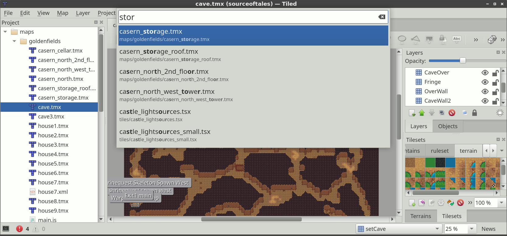

.. raw:: html

   
New in Tiled 1.4

Projects
========

What's in a Project
-------------------

A Tiled project file primarily defines the list of folders containing the
assets belonging to that project. In addition, it provides an anchor for the
:ref:`session file <sessions>`.

Apart from to the list of folders, a project currently has the following
properties, which can be changed through the *Project -> Project
Properties...* dialog.

Extensions Directory
   A project-specific directory where you can put :doc:`Tiled extensions
   </reference/scripting>`. It defaults to simply ``extensions``, so when you
   have a directory called "extensions" alonside your project file it will be
   picked up automatically.

   The directory is loaded in addition to the global extensions.

Object Types File
   Refers to the file defining the object types. Be sure to specify this file
   before opening the :ref:`Object Types Editor <predefining-properties>`, to
   make sure any types you define are saved to the right location.

   When left unspecified, object type definitions are saved to a global
   location.

Automapping Rules File
   Refers to an :doc:`automapping` rules file that should be used for all maps
   while this project is loaded. It is ignored for maps that have a
   ``rules.txt`` file saved alongside them.

.. _sessions:

Sessions
--------

Each project file gets an associated *.tiled-session* file, stored alongside
it. The session file should generally not be shared with others and stores
your last opened files, part of their last editor state, last used parameters
in dialogs, etc.

When switching projects Tiled automatically switches to the associated
session, so you can easily resume where you left off. When no project is
loaded a global session file is used.

Opening a File in the Project
-----------------------------

Another advantage of setting up a project is that you can quickly open any
file with a recognized extension located in one of the folders of the project.
Use *File -> Open File in Project* (``Ctrl+P``) to open the file filter and
just type the name of the file you'd like to open.

   Open File in Project

.. topic:: Future Extensions
   :class: future

   There are many ways in which the projects could be made more powerful:

   -  Make the project accessible through the :doc:`scripting API
      </reference/scripting>`.

   -  Allow turning off features on a per-project basis, to simplify the UI
      and reduce the chance of accidentally doing something your project
      doesn't support.

   -  Recognizing the various assets in your project, so that selection of
      images, tilesets and templates can be made more efficient (potentially
      replacing the system file dialog).

   If you like any of these plans, please help me getting around to it
   faster by `sponsoring Tiled development <https://www.mapeditor.org/donate>`__. The
   more support I receive the more time I can afford to spend improving
   Tiled!
