Using Terrains
==============

When editing a tile map, sometimes we don't think in terms of *tiles* but
rather in terms of *terrains* - areas of tiles with transitions to other kinds
of tiles. Say we want to draw a patch of grass, a road or a certain platform.
In this case, manually choosing the right tiles for the various transitions or
connections quickly gets tedious. The :ref:`terrain-tool` was added to make
editing tile maps easier in such cases.

.. warning::

    While Tiled has supported terrains since version 0.9 and later supported a
    similar feature called "Wang tiles" since version 1.1, both features were
    unified and extended in Tiled 1.5. As a result, *terrain information
    defined in Tiled 1.5 can't be used by older versions.*

The Terrain Brush relies on the tileset providing one or more *Terrain Sets* -
sets of tiles labeled according to their terrain layouts. Tiled supports the
following terrain sets:

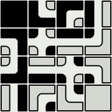

Corner Set
    Tiles that needs to match neighboring tiles at their corners, with a
    transition from one type of terrain to another in between. A complete set
    with 2 terrains has 16 tiles.

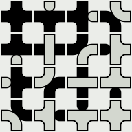

Edge Set
    Tiles that need to match neighboring tiles at their sides. This is common
    for roads, fences or platforms. A complete set with 2 terrains has 16
    tiles.

Mixed Set
    Tiles that rely on matching neighboring tiles using both their corners and
    sides. This allows a tileset to provide more variation, at the cost of
    needing significantly more tiles. A complete set with 2 terrains has 256
    tiles, but reduced sets like the 47-tile `Blob tileset`_ can be used with
    this type as well.

Based on the information in a terrain set, the :ref:`terrain-tool` can
understand the map and automatically choose the right tiles when making edits.
When necessary, it also adjusts neighboring tiles to make sure they correctly
connect to the modified area. A terrain set can contain up to 254 terrains.

The :ref:`stamp-tool`, as well as the :ref:`bucket-fill-tool` and the
:ref:`shape-fill-tool`, also have a mode where they can :ref:`fill an area with
random terrain <terrain-fill-mode>`.

.. _define-terrain-information:

Define the Terrain Information
------------------------------

Creating the Terrain Set
^^^^^^^^^^^^^^^^^^^^^^^^

First of all, switch to the tileset file. If you're looking at the map
and have the tileset selected, you can do this by clicking the small
*Edit Tileset* button below the Tilesets view.

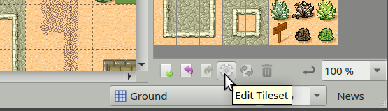

   Edit Tileset button

Then, activate the terrain editing mode by clicking on the *Terrain Sets*
|terrain| button on the tool bar. With this mode activated, the *Terrain Sets*
view will become visible, with a button to add a new set. In this example,
we'll define a *Corner Set*.

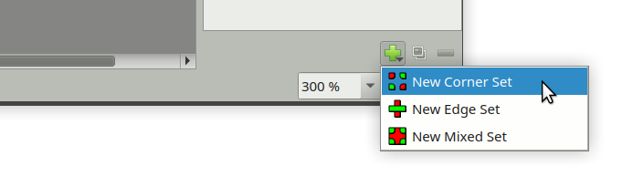

   Adding a Terrain Set

When adding a terrain set, the name of the new set will automatically get
focus. Give the set a recognizable name, in the example we'll type "Desert
Ground". We can also set one of the tiles as the icon of the set by
right-clicking a tile and choosing "Use as Terrain Set Image".

Adding Terrains
^^^^^^^^^^^^^^^

The new set will have one terrain added by default. If we already know we need
additional ones, click the *Add Terrain* button to add more.

Each terrain has a name, color and can have one of the tiles as its icon it to
make it more recognizable. Double-click the terrain to edit its name. To
change the color, right-click the terrain and choose "Pick Custom Color". To
assign an icon, select the terrain and then right-click a tile, choosing "Use
as Terrain Image".

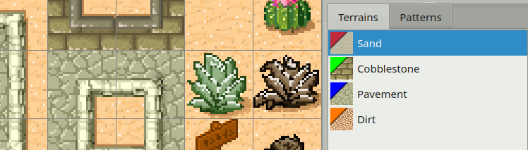

   Our Terrains

.. note::

    We generally don't need to define an explicit terrain for "empty tiles".
    If you have tiles transitioning to nothing, it should be enough to not
    mark those areas.

With our terrains set up we're ready to mark each of our tiles.

Marking the Tiles
^^^^^^^^^^^^^^^^^

Note that for a *Corner Set*, we can only mark the corners of the tiles. For a
*Edge Set*, we're limited to marking the edges of our tiles. If we need both
we need to use a *Mixed Set*. If it turns out that we chose the wrong type of
terrain set, we can still change the type in the Properties view (right-click
the terrain set and choose *Terrain Set Properties...*).

With the terrain we want to mark selected, click and drag to mark the regions
of the tiles that match this terrain.

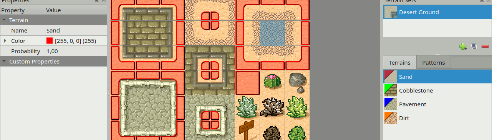

   Here we have marked all the sandy corners in our example tileset.

If you make a mistake, just use Undo (or press ``Ctrl+Z``). Or if you
notice a mistake later, either use *Erase Terrain* to clear a terrain type
from a corner or select the correct terrain type and paint over it. Each
corner can only have one type of terrain associated with it.

Now do the same for each of the other terrain types. Eventually you'll have
marked all tiles apart from the special objects.

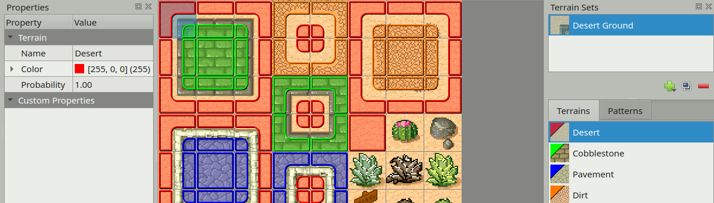

   We're done marking the terrain of our tiles.

Patterns View
~~~~~~~~~~~~~

Next to the *Terrains* tab there's also a *Patterns* tab. This view can be
useful when marking complete sets, since it can highlight still missing
patterns. Each pattern which already occurs on a tile in the tileset is
darkened, to make the missing patterns stand out. Note though, that it is not
necessary for a terrain set to have all possible patterns, especially when
using more than 2 terrains.

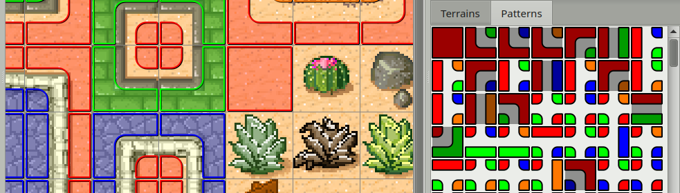

   Patterns view, showing all possible combinations in the set.

Editing with the Terrain Brush
------------------------------

Now you can disable the *Terrain Sets* |terrain| mode by clicking the tool bar
button again. Then switch back to the map and activate the *Terrain Sets*
window. Select the terrain set we have just set up, so we can use its
terrains.

Click on the Sand terrain and try to paint. You may immediately notice that
nothing is happening. This is because there are no other tiles on the map yet,
so the terrain tool doesn't really know how to help (because we also have no
transitions to "nothing" in our tileset). There are two ways out of this:

* We can hold ``Ctrl`` (``Command`` on a Mac) to paint a slightly larger area.
  This way we will paint at least a single tile filled with the selected
  terrain, though this is not convenient for painting larger areas.

* Assuming we're out to create a desert map, it's better to start by filling
  the entire map with sand. Just switch back to the *Tilesets* window for a
  moment, select the sand tile and then use the :ref:`bucket-fill-tool`.

Once we've painted some sand, let's select the Cobblestone terrain. Now you
can see the tool in action!

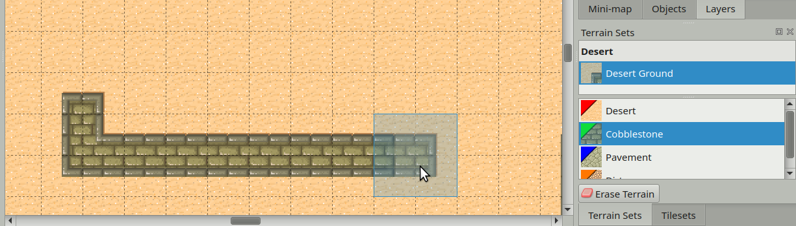

   Drawing cobblestone

Finally, see what happens when you try drawing some dirt on the
cobblestone. Because there are no transitions from dirt directly to
cobblestone, the Terrain tool first inserts transitions to sand and from
there to cobblestone. Neat!

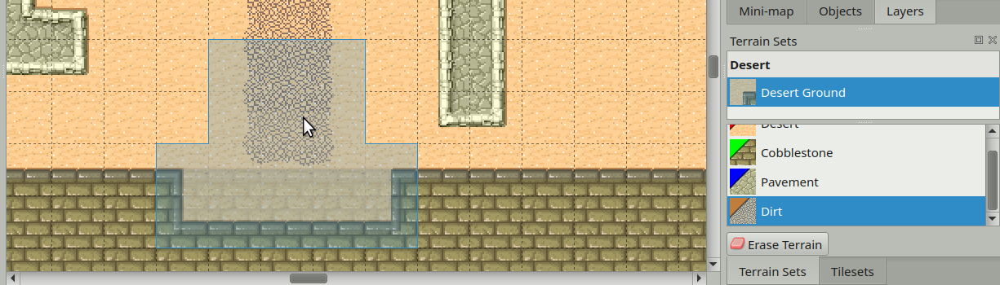

   Drawing dirt

.. note::

    An *Erase Terrain* button is provided for the case where your terrain
    tiles transition to nothing. This allows for erasing parts of your terrain
    while choosing the right tiles as well. This mode does nothing useful when
    there are no transitions to nothing in the selected Terrain Set.

.. _terrain-fill-mode:

Terrain Fill Mode
-----------------

The :ref:`stamp-tool`, :ref:`bucket-fill-tool` and the :ref:`shape-fill-tool`
have a *Terrain Fill Mode*, which can be used to paint or fill an area with
random terrain. With this mode activated, each cell will be randomly chosen
from all those in the selected Terrain Set, making sure to match all adjacent
edges and/or corners.

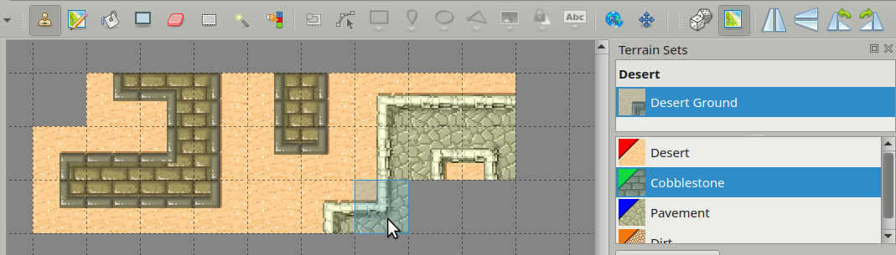

   Stamp Brush with Terrain Fill Mode Enabled

Note that since this mode makes sure that newly placed tiles match up with any
already existing tiles, generally nothing will change when painting with the
Stamp Brush on existing terrain. The exception is when there are multiple
variations of the same tile, in which case it will randomize between those.

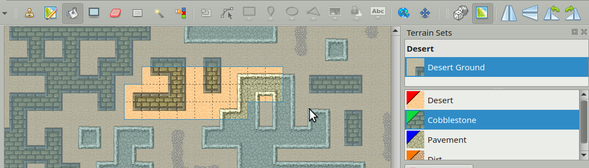

   Bucket Fill with Terrain Fill Mode Enabled

When filling a shape or an area, only the edges of the filled area need to
connect to any existing tiles. Internally the area is completely randomized.

Tile and Terrain Probability
----------------------------

Both the :ref:`terrain-fill-mode` and the Terrain Brush will by default
consider all matching tiles with equal probability. Both individual tiles as
well as terrains have a *Probability* property, which can be used to change
the frequency with which a certain tile or terrain is chosen compared to other
valid options.

The relative probability of a tile is the product of its own probability and
the probability of the terrain at each corner and/or side.

.. figure:: images/terrain/low-and-high-probability.png

    Left shows "path" with probability 0.1, right shows "path" with
    probability 10.

Probability for Variations
^^^^^^^^^^^^^^^^^^^^^^^^^^

A common usage for probability, especially at the individual tile level, is to
make certain variations of a tile less common than others. Our example tileset
contains several bushes and other decorations which we may randomly want to
scatter across the desert.

To achieve this, first of all we mark all of them as "sand" tiles, because
this is their base terrain. Then, to make them less common than the regular
sand tile, we can put their probability on 0.01. This value means they are
each 100 times less likely to be chosen than the regular sand tile (which
still has its default probability of 1). To edit the *Probability* property of
the tiles we need to exit the *Terrain Sets* mode.

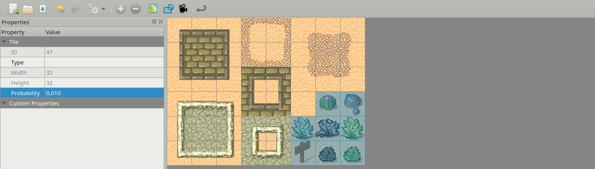

   Setting low probability on decoration tiles.

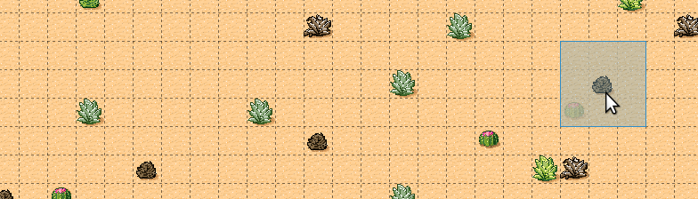

   Random decorative tiles appearing with low probability.

.. hint::

    It is also possible to put the probability to 0, which disables automatic
    usage of a tile entirely. This can be useful because it still makes the
    tools aware of the terrain of a certain tile, which is taken into account
    when modifying neighboring tiles.

.. raw:: html

    
Since Tiled 1.5

Tile Transformations
--------------------

Tiled supports flipping and rotating tiles. When using terrains, tiles can be
automatically flipped and/or rotated to create variations that would otherwise
not be available in a tileset. This can be enabled in the *Tileset
Properties*.

The following transformation-related options are available:

Flip Horizontally
    Allow tiles to be flipped horizontally.

Flip Vertically
    Allow tiles to be flipped vertically. This would be left disabled when the
    graphics contain shadows in vertical direction, for example.

Rotate
    Allow tiles to be rotated (by 90, 180 or 270-degrees).

Prefer Untransformed Tiles
    When transformations are enabled, it could happen that a certain pattern
    can be filled by either a regular tile or a transformed tile. With this
    option enabled, the untransformed tiles will always take precedence.
    Leaving this option disabled allows transformations to be used to create
    more variation.

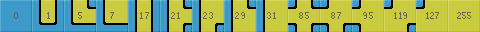

   With rotations enabled, the normally 47-tiles `Blob tileset`_ can be
   reduced to a mere 15 tiles.

Final Words
-----------

Now you should have a pretty good idea about how to use this tool in
your own project. A few things to keep in mind:

- For one terrain to interact with another, they need to be part of the same
  *Terrain Set*. This also means all tiles need to be part of the same
  tileset. If you have tiles in different tilesets that you want to transition
  to one another, you will need to merge the tilesets into one.

- Since defining the terrain information can be somewhat laborious,
  you'll want to avoid using embedded tilesets so that terrain
  information can be shared among several maps.

- The Terrain tool works fine with isometric maps as well. To make sure
  the terrain overlay is displayed correctly, set up the *Orientation*,
  *Grid Width* and *Grid Height* in the tileset properties.

- The tool will handle any number of terrains (up to 254) and each corner of a
  tile can have a different type of terrain. Still, there are other ways of
  dealing with transitions that this tool can't handle. Also, it is not able
  to edit multiple layers at the same time. For a more flexible, but also more
  complicated way of automatic tile placement, check out :doc:`automapping`.

- There's a `collection of tilesets
  <http://opengameart.org/content/terrain-transitions>`__ that contain
  transitions that are compatible with this tool on `OpenGameArt.org
  <http://opengameart.org/>`__.

.. _blob tileset: https://web.archive.org/web/20230101/cr31.co.uk/stagecast/wang/blob.html

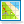

..
    TODO:

    Include some section about how the algorithm works:

    * An image showing an original set-up (e.g. all Sand tiles) with the terrain labels overlaid to show how it's all sand.
    * An image showing what a click replacing one corner would initially do (change the corner label)
    * An image showing what Tiled does to remedy this (adjust the surrounding corners), showing the different tiles placed underneath

    Optionally, a similar sequence of images showing a Ctrl click. Original -> all corners changed -> neighboring corners adjusted.
