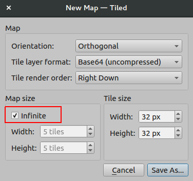
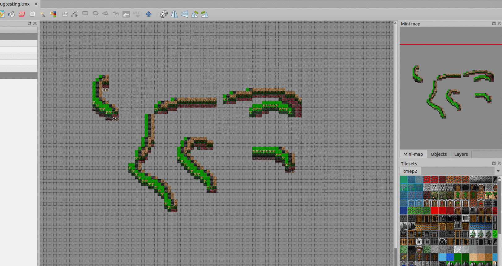
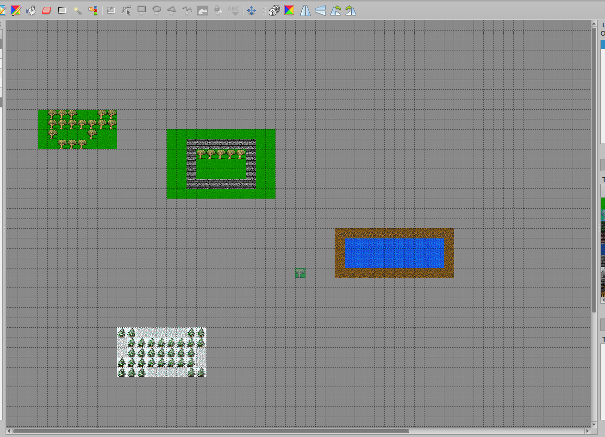
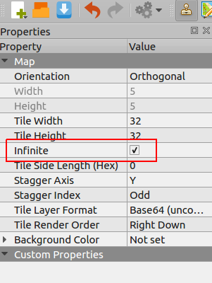
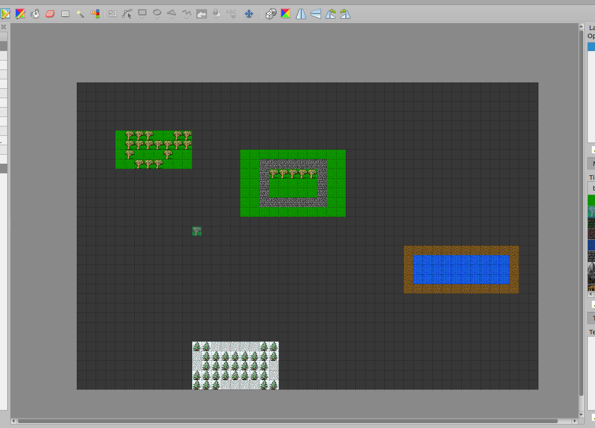

.. raw:: html

   
Since Tiled 1.1

Using Infinite Maps
===================

Infinite maps in Tiled free you from the constraints of the fixed-size map. 
With an "auto-growing" canvas, you can paint on an infinite grid without being 
limited by width and height. This document guides you through creating, editing, 
and converting infinite maps in Tiled.

.. figure:: images/infinite/infinite-map-overview.png
   :alt: A zoomed-out Tiled window shows a very large infinite map being edited.

Creating an Infinite Map
------------------------

1. Open the New Map dialog (*File -> New -> New Map*).
2. Ensure the 'Infinite' option is selected.

The map you create will have an infinite canvas.

Editing an Infinite Map
------------------------

Most tools in Tiled work the same way for infinite maps as they do for fixed-size maps. 
However, the :ref:`bucket-fill-tool` fills only the current bounds of a tile layer.
As you paint, these bounds expand.

Converting Between Infinite And Fixed-Size Maps
-----------------------------------------------------

You can toggle between infinite and fixed-size maps in the Map Properties window. 
When converting an infinite map to a fixed-size map, Tiled determines the final map's 
width and height based on the bounds of all tile layers.

   The Initial Infinite Map

   Unchecking the Infinite property in Map Properties

   The Converted Map
