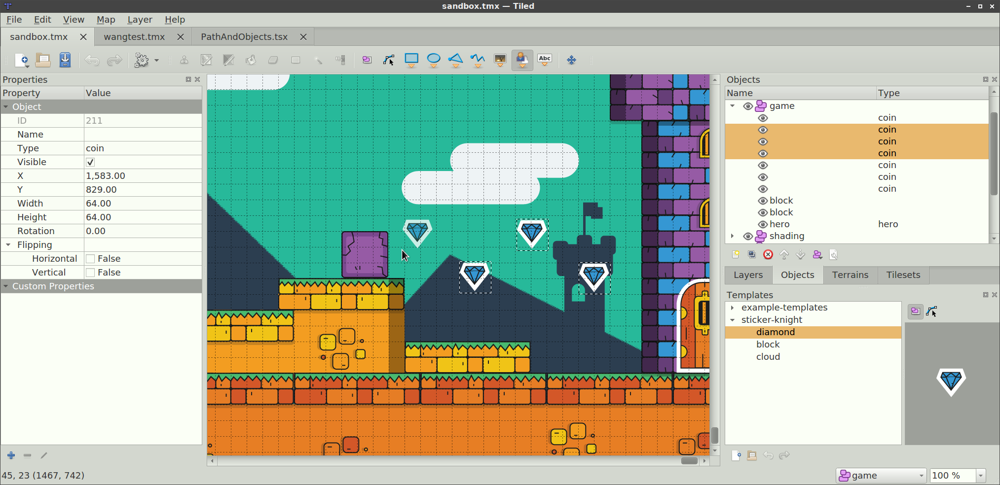
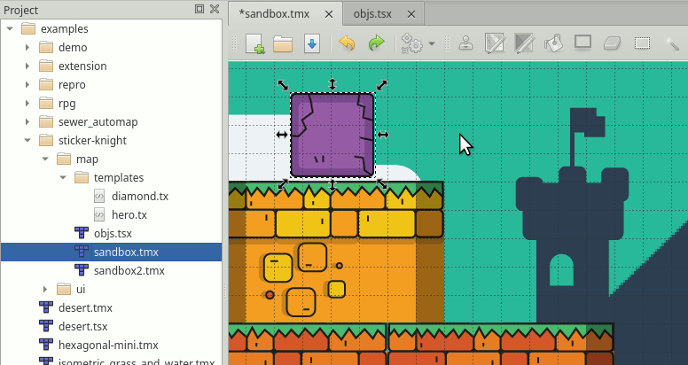
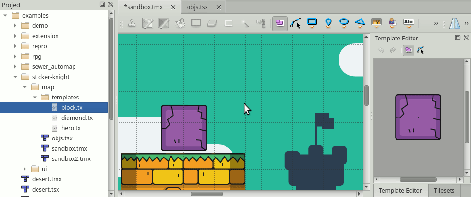
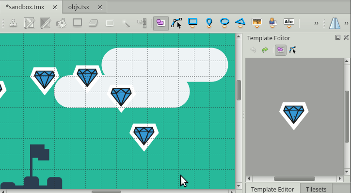

.. raw:: html

   
New in Tiled 1.1

Using Templates
===============

Any created object can be saved as a template. These templates can then be
instantiated elsewhere as objects that inherit the template's properties. This
can save a lot of tedious work of setting up the object type and properties, or
even just finding the right tile in the tileset.

Each template is stored in its own file and they can be organized in
directories. You can save templates in either XML or JSON format, just
like map and tileset files.

Creating Templates
------------------

A template can be created by right clicking on any object in the map and
selecting "Save As Template". You will be asked to choose the file name
and the format to save the template in. If the object already has a name
the suggested file name will be based on that.

.. note:: You can't create a template from a tile object that uses a
   tile from an embedded tileset, because
   :ref:`template files <tmx-template-files>` do not support
   referring to such tilesets.

The Templates View
------------------

Working with templates is done through the Templates view. The Templates
view is divided into two parts: the left part is a tree view that shows
the template files in a selected directory and the right part shows a
preview of the selected template.

.. _creating-template-instances:

Creating Template Instances
---------------------------

Shortcut: ``V``

Template instantiation works by either dragging and dropping the template from
the list of templates to the map, or by using the "Insert Template" tool
by selecting a template and clicking on the map which is more convenient when
you want to create many instances.

Editing Templates
-----------------

Selecting a template will show an editable preview in the Templates view and
will show the template's properties in the Properties view where they can be
edited. Changes to the template are saved automatically.

All template instances are linked to their template, so all edits will be
immediately reflected upon all the template instances on the map.

If a property of a template instance is changed, it will be internally marked
as an overridden property and won't be changed when the template changes.

Detaching Template Instances
----------------------------

Detaching a template instance will disconnect it from its template, so any
further edits to the template will not affect the detached instance.

To detach an instance, right click on it and select *Detach*.

.. topic:: Future Extensions
   :class: future

    - Resetting overridden properties individually (`#1725 <https://github.com/bjorn/tiled/issues/1725>`__).
    - Locking template properties (`#1726 <https://github.com/bjorn/tiled/issues/1726>`__).
    - Handling wrong file paths (`#1732 <https://github.com/bjorn/tiled/issues/1732>`__).
    - Managing the templates folder, e.g. moving, renaming or deleting a template or a sub-folder
      (`#1723 <https://github.com/bjorn/tiled/issues/1723>`__).
