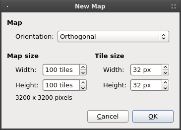
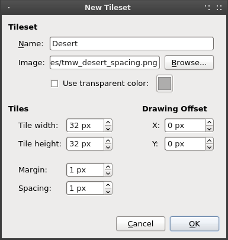
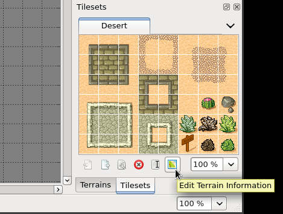
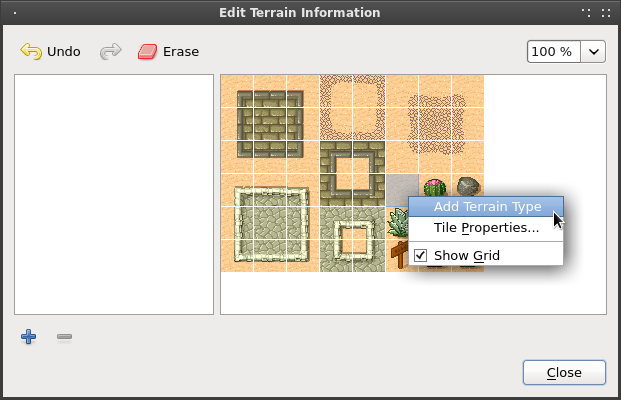
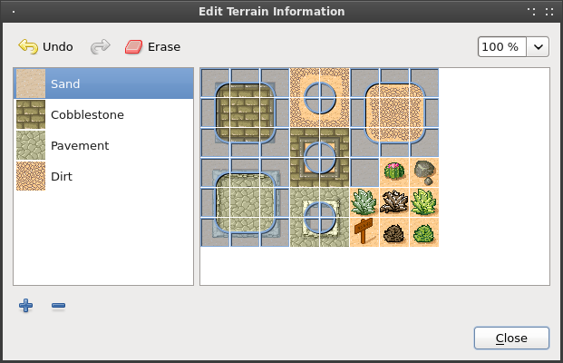
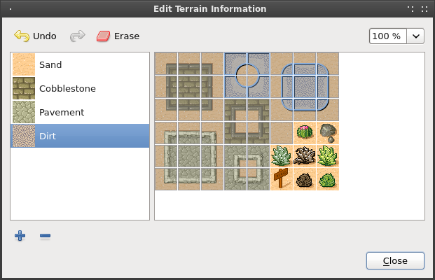
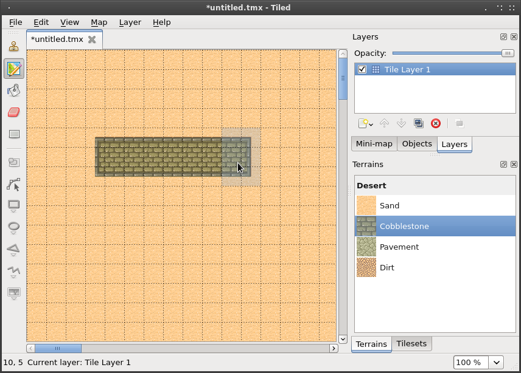
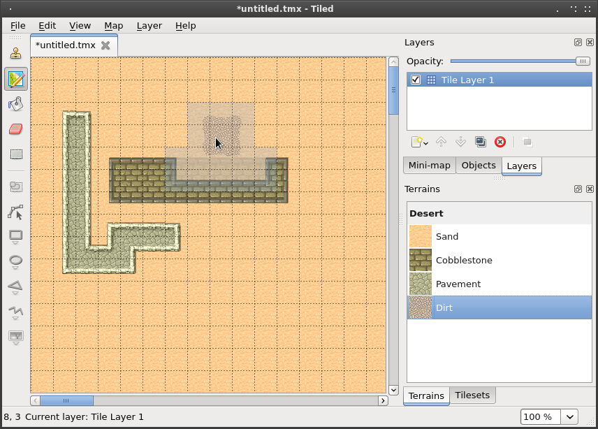

# Using the Terrain Tool

Starting with Tiled 0.9.0, a new tool was added specifically to make editing tile maps easier when using terrain transitions. There are of course multiple ways to do transitions between tiles. The Terrain tool in Tiled supports transition tiles that have a well-defined terrain type at each of their 4 corners, which seems to be the most common method.

To demonstrate how to use this tool I will describe the steps necessary to reproduce the `desert.tmx` example map, which now also includes terrain information in its tileset.

## Create a New Map and Add a Tileset ##

First of all create a new orthogonal map with a tile size of 32x32 pixels.

  

Then, add the `tmw_desert_spacing.png` example tileset. This tileset uses a margin and spacing of 1 pixel (which is only to test if this functionality works, not because I'd recommend doing that).

  

This tileset has 4 different terrain types. Traditionally editing a map with these tiles meant that you had to carefully connect the right transitions to avoid broken edges. Now we will define the terrain information for this tileset, which the Terrain tool will use to automatically place the right transitions.

## Define the Terrain Information ##

Click the small "Edit Terrain Information" button.

  

This dialog displays the list of terrain types in the tileset and allows you to mark corners of the tiles in your tileset as belonging to a certain terrain type. To start with, add each of the 4 terrain types. The fastest way is by right-clicking on a tile representing a certain terrain and choosing "Add Terrain Type". This automatically sets the tile as the image representing the terrain.

  

Give each of the terrains an appropriate name. Once you're done, select the sand terrain and mark all corners in the tileset with this type of terrain. When you're done it should look like this:

  

If you make a mistake, just use Undo (or press `Ctrl+Z`). Or if you notice a mistake later, either use the eraser to clear a terrain type from a corner or select the correct terrain type and paint over it.

Do the same for each of the other terrain types. Eventually you'll have marked all tiles apart from the special objects.

  

Now close the dialog so we can start trying out the Terrain tool.

## Editing with the Terrain Tool ##

Switch from the Tilesets to the Terrains window. You should see the 4 terrain types represented in a list. Click on the sand terrain and start painting. You may immediately notice that nothing special is happening. This is because there are no other tiles on the map yet so the terrain tool doesn't really know how to help (because we have no transitions to "nothing" in our tileset). Assuming we're out to create a desert map, it's better to start by filling your entire map with sand. Just switch back to the Tilesets window for a moment, select the sand tile and then use the Fill tool.

Let's switch back to the Terrains window and draw some cobblestones. Now you can see the tool in action!

  

Try holding `Control` (`Command` on a Mac) while drawing. This reduces the modified area to just the closest corner to the mouse, allowing for precision work.

Finally, see what happens when you try drawing some dirt on the cobblestone. Because there are no transitions from dirt directly to cobblestone, the Terrain tool first inserts transitions to sand and from there to cobblestone. Neat!

  

## Final Words ##

Now you should have a pretty good idea about how to use this tool in your own project. A few things to keep in mind:

* Currently the tool requires all terrain types to be part of the same tileset. You can have multiple tilesets with terrain in your map, but the tool can't perform automatic transitions from a terrain from one tileset to a terrain in another tileset. This usually means you may have to combine several tiles into one image.

* Since defining the terrain information can be somewhat laboursome, you'll want to use the external tilesets feature of Tiled to share not only the image but also the terrain information among several maps. Note however, that it is not possible to edit the terrain information while the tileset is external. To work around this problem just temporarily import the tileset and then export it again.

* The Terrain tool works fine with isometric maps as well (though not with the new "staggered" isometric maps). However, the Edit Terrain Information dialog is currently not able to render the overlay correctly for isometric tiles. When defining terrain for isometric tiles, imagine the top-left corner applies to the top of your isometric tile, the top-right corner applies to the right corner of your tile, etc. Check out the `isometric_grass_and_water.tmx` example when in doubt.

* The tool will handle any number of terrain types and each corner of a tile can have a different type of terrain. Still, there are other ways of dealing with transitions that this tool can't handle. Also, it is not able to edit multiple layers at the same time. For a more flexible, but also more complicated way of automatic tile placement, check out [[Automapping]].

* I'm maintaining a [collection of tilesets](http://opengameart.org/content/terrain-transitions) that contain transitions that are compatible with this tool on [OpenGameArt.org](http://opengameart.org/).
