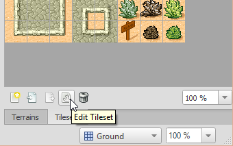
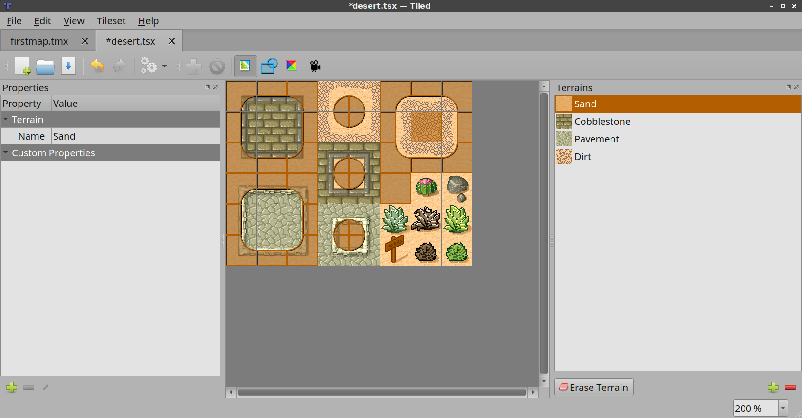
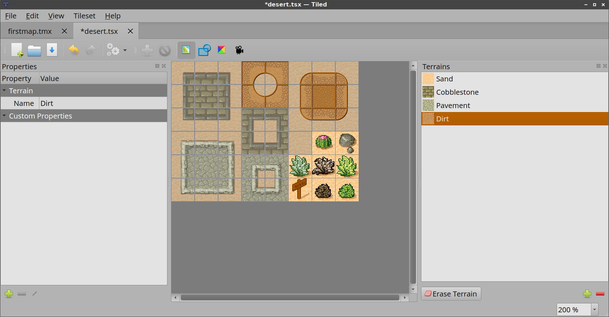
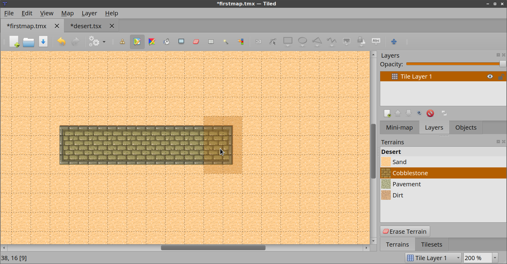
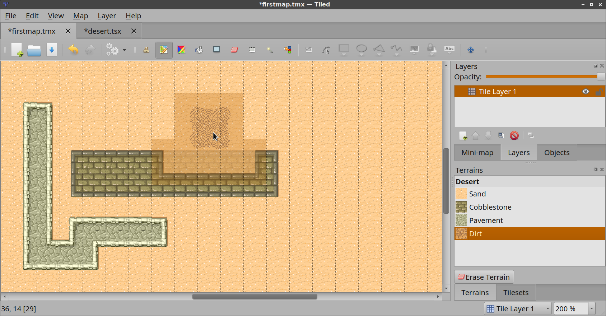
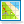

Using the Terrain Brush
=======================

The :ref:`terrain-tool` was added to make editing tile maps easier when
using terrain transitions. There are of course multiple ways to do
transitions between tiles. This tool supports transition tiles that have
a well-defined terrain type at each of their 4 corners, which seems to
be the most common method.

To demonstrate how to use this tool we describe the steps necessary to
reproduce the ``desert.tmx`` example map, which now also includes
terrain information in its tileset.

Create a New Map and Add a Tileset
----------------------------------

First of all, follow the :ref:`getting-started` instructions to set up
the map and the tileset.

The ``tmw_desert_spacing.png`` tileset we just set up has 4 different
terrain types. Traditionally editing a map with these tiles meant that
you had to carefully connect the right transitions to avoid broken
edges. Now we will define the terrain information for this tileset,
which the :ref:`terrain-tool` will use to automatically place the right
transitions.

.. _define-terrain-information:

Define the Terrain Information
------------------------------

First of all, switch to the tileset file. If you're looking at the map
and have the tileset selected, you can do this by clicking the small
*Edit Tileset* button below the Tilesets view.

   Edit Tileset button

Then, activate the terrain editing mode by clicking on the *Terrains*
|terrain| button on the tool bar.

In this mode, the list of terrain types is displayed and you can mark
corners of the tiles in your tileset as belonging to a certain terrain
type. To start with, add each of the 4 terrain types. The fastest way is
by right-clicking on a tile representing a certain terrain and choosing
"Add Terrain Type". This automatically sets the tile as the image
representing the terrain.

.. figure:: images/terraintool/02-editterraindialog-add.png
   :alt: Adding Terrain Type

   Adding Terrain Type

Give each of the terrains an appropriate name. Once you're done, select
the Sand terrain and mark all corners in the tileset with this type of
terrain. When you're done it should look like this:

   Sand Terrain Marked

If you make a mistake, just use Undo (or press ``Ctrl+Z``). Or if you
notice a mistake later, either use *Erase Terrain* to clear a terrain type
from a corner or select the correct terrain type and paint over it.

Do the same for each of the other terrain types. Eventually you'll have
marked all tiles apart from the special objects.

   Done Marking Terrain

Now you can disable the *Terrains* mode by clicking the tool bar button
again.

Editing with the Terrain Brush
------------------------------

Switch back to the map and then activate the Terrains window. You should
see the 4 terrain types represented in a list. Click on the Sand terrain
and start painting. You may immediately notice that nothing special is
happening. This is because there are no other tiles on the map yet so
the terrain tool doesn't really know how to help (because we have no
transitions to "nothing" in our tileset). Assuming we're out to create a
desert map, it's better to start by filling your entire map with sand.
Just switch back to the Tilesets window for a moment, select the sand
tile and then use the :ref:`bucket-fill-tool`.

Let's switch back to the Terrains window and draw some cobblestones. Now
you can see the tool in action!

   Drawing Cobblestone

Try holding ``Control`` (``Command`` on a Mac) while drawing. This
reduces the modified area to just the closest corner to the mouse,
allowing for precision work.

Finally, see what happens when you try drawing some dirt on the
cobblestone. Because there are no transitions from dirt directly to
cobblestone, the Terrain tool first inserts transitions to sand and from
there to cobblestone. Neat!

   Drawing Dirt

Final Words
-----------

Now you should have a pretty good idea about how to use this tool in
your own project. A few things to keep in mind:

-  Currently the tool requires all terrain types to be part of the same
   tileset. You can have multiple tilesets with terrain in your map, but
   the tool can't perform automatic transitions from a terrain from one
   tileset to a terrain in another tileset. This usually means you may
   have to combine several tiles into one image.

-  Since defining the terrain information can be somewhat laboursome,
   you'll want to avoid using embedded tilesets so that terrain
   information can be shared among several maps.

-  The Terrain tool works fine with isometric maps as well. To make sure
   the terrain overlay is displayed correctly, set up the *Orientation*,
   *Grid Width* and *Grid Height* in the tileset properties.

-  The tool will handle any number of terrain types and each corner of a
   tile can have a different type of terrain. Still, there are other
   ways of dealing with transitions that this tool can't handle. Also,
   it is not able to edit multiple layers at the same time. For a more
   flexible, but also more complicated way of automatic tile placement,
   check out :doc:`automapping`.

-  I'm maintaining a `collection of
   tilesets <http://opengameart.org/content/terrain-transitions>`__ that
   contain transitions that are compatible with this tool on
   `OpenGameArt.org <http://opengameart.org/>`__.

