.. raw:: html

   
New in Tiled 1.1

Using Wang Tiles
================

Wang tiles are similar in concept to Terrains. This is, however, more focused
on filling larger areas without repetition. One defines the edge and
corner colors of tiles in a tileset. This information can then be used when
filling, or brushing to allow for smooth, non-repetitive transitions between
tiles. In most cases this tiling is random, and based on color probability.
More info on Wang tiles can be found `here <http://www.cr31.co.uk/stagecast/wang/intro.html>`_.

To demonstrate how to use Wang tiles, I will describe the steps necessary
to recreate ``walkways.tsx`` example tileset.

.. _defining-wang-tile-info:

Defining Wang Tile Info
-----------------------

After making the tileset, from the tileset editor, click the Wang Sets button.

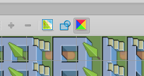

   Wang Set Button

A single tileset can have many Wang sets. Create a new Wang set using the plus
button at the bottom of the Wang set view.

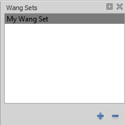

   Wang Set View

You can now edit the properties of the Wang set. Important for us is edge
and corner count. This will determine how the set is defined, and how it
behaves. This tileset is a 3 edge Wang set.

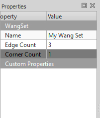

   Wang Set Properties

Now in the complete pattern set will generate in the *Patterns* tab below
the Wang set view. For the set to be complete (though this is unnecessary),
each pattern must be used at least once.

.. figure:: images/wangtiles/04-patternview.jpg

   Pattern View

Once a pattern is selected, you can paint it directly onto the tileset.
Similar to when using the Stamp Brush, ``Z`` and ``Shift + Z`` can be used
to rotate the pattern 90 degrees clockwise and counterclockwise respectively.
``X`` and ``Y`` flip the pattern horizontally, and vertically respectively.

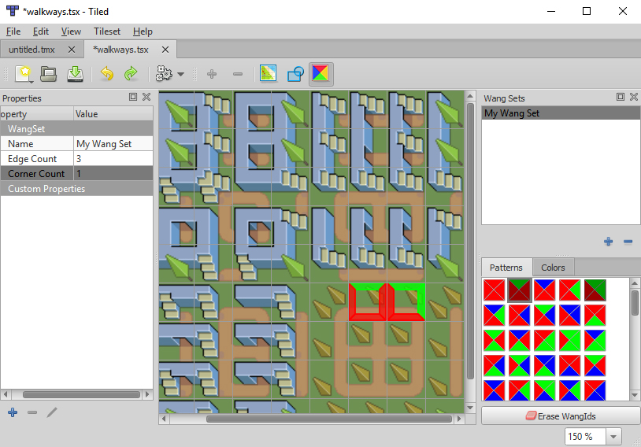

   Painting on a Pattern

In the other tab, there is the *Colors* view. This gives you access to
edit properties and assign with each individual color of a set.

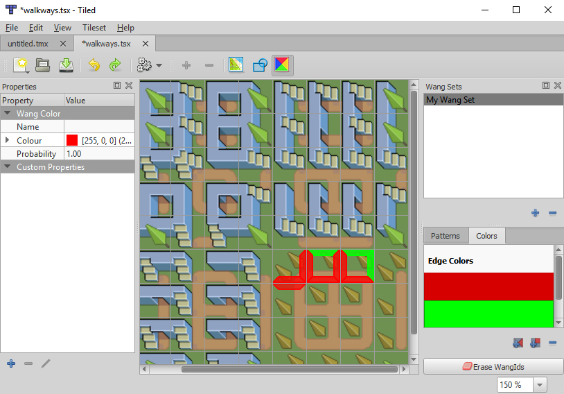

   Painting Individual Edge

Using these methods, assign each tile matching all the edges. After this
is done, the set is ready to be used with all the Wang methods.

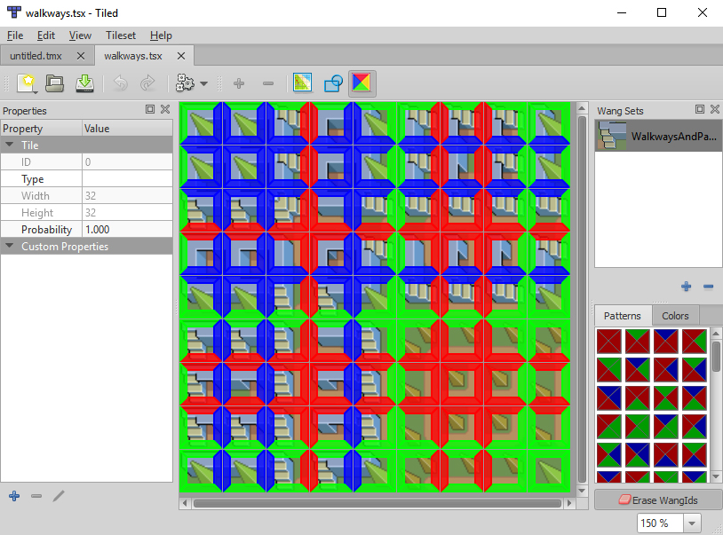

   Completely Assigned Wang Set

Editing With Wang Methods
-------------------------

There are two main ways to use Wang tiles:

-  Activating the `Wang mode <#wang-mode>`__

-  Using the `Wang brush <#wang-brush>`__

Wang Mode
^^^^^^^^^
Similar to the random mode, the Stamp Brush, and Bucket Fill tools can use Wang methods to fill.
With the Wang mode activated, each cell will be randomly chosen from all those in the Wang set which
match all adjacent edge/corner colors.

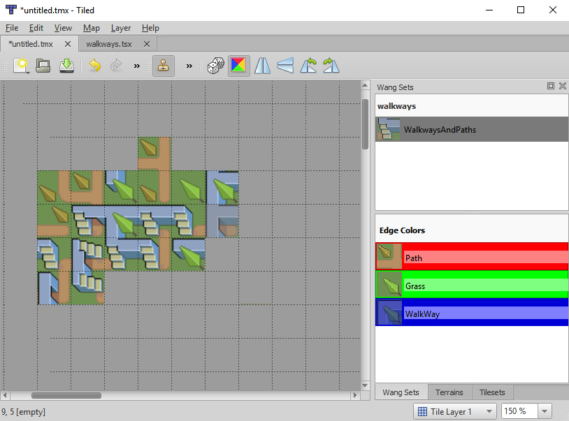

   Stamp Brush with Wang Fill Mode Enabled

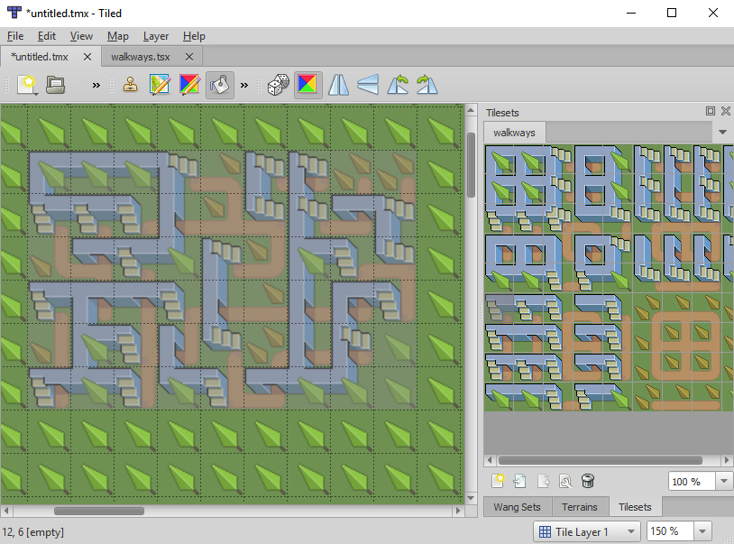

   Bucket Fill with Wang Fill Mode Enabled

Wang Brush
^^^^^^^^^^
There is also the :ref:`wang-tool`, which works very much like the :ref:`terrain-tool`.
This tool changes the edge/color patterns of the adjacent cells, to match a selected color.
If no tiles exist in the Wang set of a particular pattern, the area can not be painted.

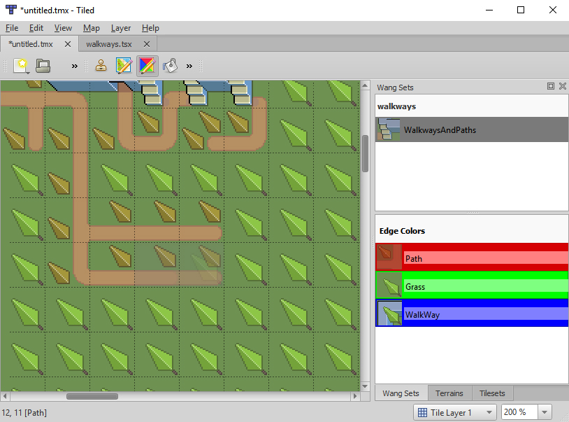

   Wang Brush

Customizing Wang Colors
-----------------------

Each Wang color can be customized to become more recognizable. As well, the probability of each
color can be adjusted, such that with the Wang mode it will show up more often in filling or brushing.

Color Appearance
^^^^^^^^^^^^^^^^
The name, image, and of course color can be changed to alter the appearance  of a Wang color.
This image can be changed be selecting a color, then right clicking on the tile whose image
is desired, and selecting *Set Wang Color Image*.

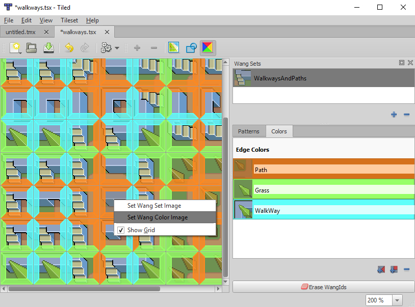

   Selecting Wang color image

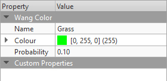

   The other values can be changed from the properties view.

Probability
^^^^^^^^^^^
When choosing a tile with Wang methods, all tiles with a valid Wang pattern are considered.
They are given a weight based on their edge/corner colors' probabilities. Then one is selected
at random, while considering this weight. The weight is the product of all the probabilities.

.. image:: images/wangtiles/13-lowprobability.jpg
   :width: 45 %
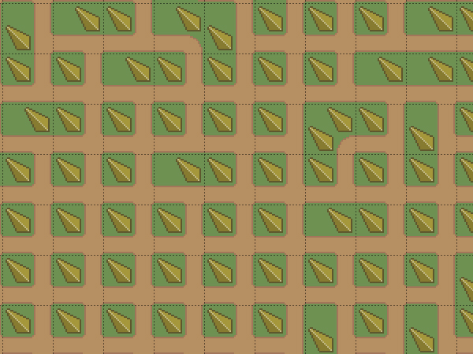

Left shows path with probability 0.1, right shows path with probability 10.

Standard Wang Sets
------------------

Some typical Wang sets are `2-corner <http://www.cr31.co.uk/stagecast/wang/2corn.html>`__,
`2-edge <http://www.cr31.co.uk/stagecast/wang/2edge.html>`__, and
`blob <http://www.cr31.co.uk/stagecast/wang/blob.html>`__. Wang tiles
in Tiled support up to 15 edge and 15 corner colors in a single set.
