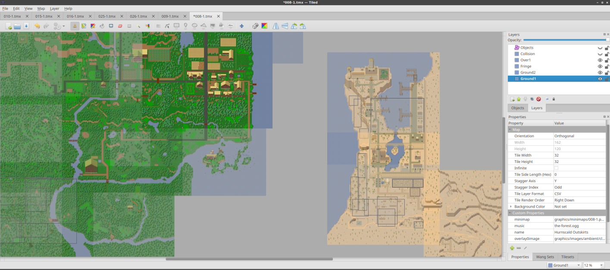

.. raw:: html

   
Since Tiled 1.2

Working with Worlds
===================

Sometimes a game has a large world which is split over multiple maps to make
the world more digestible by the game (less memory usage) or easier to edit by
multiple people (avoiding merge conflicts). It would be useful if the maps
from such a world could be seen within the same view, and to be able to
quickly switch between editing different maps. Defining a world allows you to
do exactly that.

   Many maps from `The Mana World <https://www.themanaworld.org/>`__ shown at
   once.

Defining a World
----------------

Currently no interface exists in Tiled to define a world, nor can it be
edited. A world is defined in a ``.world`` file, which is a JSON file that
tells Tiled which maps are part of the world and at what location.

Here is a simple example of a world definition, which defines the global
position (in pixels) of three maps:

.. code:: json

    {
        "maps": [
            {
                "fileName": "001-1.tmx",
                "x": 0,
                "y": 0
            },
            {
                "fileName": "002-1.tmx",
                "x": 0,
                "y": 3200
            },
            {
                "fileName": "006-1.tmx",
                "x": 3840,
                "y": 4704
            }
        ],
        "type": "world"
    }

Once defined, a world needs to be loaded by choosing *Map > Load World...*
from the menu. Multiple worlds can be loaded at the same time, and worlds will
be automatically loaded again when Tiled is restarted.

When is map is opened, Tiled checks whether it is part of any of the loaded
worlds. If so, any other maps in the same world are loaded as well and
displayed alongside the opened map. You can click any of the other maps to
open them for editing, which will switch files while keeping the view in the
same position.

Worlds are reloaded automatically when their file is changed on disk.

Using Pattern Matching
----------------------

For projects where the maps follow a certain naming style that allows the
location of each map in the world to be derived from the file name, a regular
expression can be used in combination with a multiplier and an offset.

Here is an example:

.. code:: json

    {
        "patterns": [
            {
                "regexp": "ow-p0*(\\d+)-n0*(\\d+)-o0000\\.tmx",
                "multiplierX": 6400,
                "multiplierY": 6400,
                "offsetX": -6400,
                "offsetY": -6400
            }
        ],
        "type": "world"
    }

The regular expression is matched on all files that live in the same directory
as the world file. It captures two numbers, the first is taken as ``x`` and
the second as ``y``. These will then be multiplied by ``multiplierX`` and
``multiplierY`` respectively, and finally ``offsetX`` and ``offsetY`` are
added. The offset exists mainly to allow multiple sets of maps in the same
world to be positioned relative to each other. The final value becomes the
position (in pixels) of each map.

A world definition can use a combination of manually defined maps and
patterns.

Showing Only Direct Neighbors
-----------------------------

Tiled takes great care to only load each map, tileset and image once, but
sometimes the world is just too large for it to be loaded completely. Maybe
there is not enough memory, or rendering the entire map is too slow.

In this case, there is an option to only load the direct neighbors of the
current map. Add ``"onlyShowAdjacentMaps": true`` to the top-level JSON object.

To make this possible, not only the position but also the size of each map
needs to be defined. For individual maps, this is done using ``width`` and
``height`` properties. For patterns, the properties are ``mapWidth`` and
``mapHeight``, which default to the defined multipliers for convenience. All
values are in pixels.

.. note::

    In the future, I will probably change this option to allow specifying a
    distance around the current map in which other maps are loaded.
