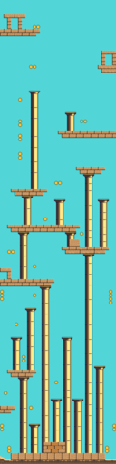
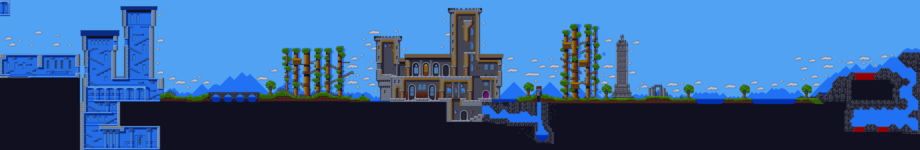
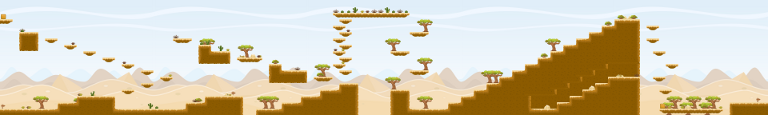
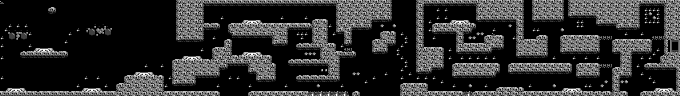

This is a collection of maps for the tiled map editor.

# jb-32

Low tile count 'desert' themed level, map size 512x2048 pixels.

# Magicland Dizzy

Large map, 7360x1200 pixels, using several hundred 16x16 tiles.

Original game is widely listed as 'abandonware', e.g.
http://www.myabandonware.com/game/magicland-dizzy-1up

This tilemap is distributed without attribution with Java gamelib2 library.

# gameart2d 'Desert'

Using the free tile set from:
http://www.gameart2d.com/free-desert-platformer-tileset.html

Map uses 128x128 tiles.

# level25

Space themed level, four-color (Gameboy)

Map uses 16x16 tiles, map size is 2720x384.

